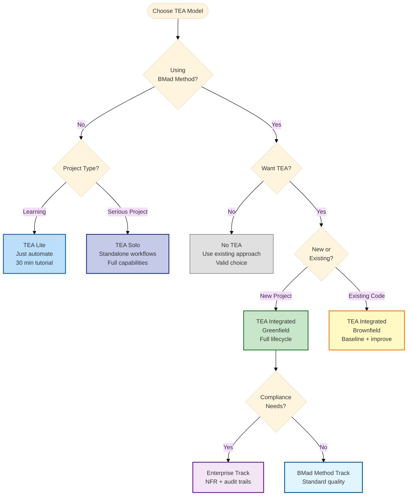

# TEA Engagement Models Explained

TEA is optional and flexible. There are five valid ways to engage with TEA - choose intentionally based on your project needs and methodology.

## Overview

**TEA is not mandatory.** Pick the engagement model that fits your context:

1. **No TEA** - Skip all TEA workflows, use existing testing approach
2. **TEA Solo** - Use TEA standalone without BMad Method
3. **TEA Lite** - Beginner approach using just `automate`
4. **TEA Integrated (Greenfield)** - Full BMad Method integration from scratch
5. **TEA Integrated (Brownfield)** - Full BMad Method integration with existing code

## The Problem

### One-Size-Fits-All Doesn't Work

**Traditional testing tools force one approach:**
- Must use entire framework
- All-or-nothing adoption
- No flexibility for different project types
- Teams abandon tool if it doesn't fit

**TEA recognizes:**
- Different projects have different needs
- Different teams have different maturity levels
- Different contexts require different approaches
- Flexibility increases adoption

## The Five Engagement Models

### Model 1: No TEA

**What:** Skip all TEA workflows, use your existing testing approach.

**When to Use:**
- Team has established testing practices
- Quality is already high
- Testing tools already in place
- TEA doesn't add value

**What You Miss:**
- Risk-based test planning
- Systematic quality review
- Gate decisions with evidence
- Knowledge base patterns

**What You Keep:**
- Full control
- Existing tools
- Team expertise
- No learning curve

**Example:**
```
Your team:
- 10-year veteran QA team
- Established testing practices
- High-quality test suite
- No problems to solve

Decision: Skip TEA, keep what works
```

**Verdict:** Valid choice if existing approach works.

---

### Model 2: TEA Solo

**What:** Use TEA workflows standalone without full BMad Method integration.

**When to Use:**
- Non-BMad projects
- Want TEA's quality operating model only
- Don't need full planning workflow
- Bring your own requirements

**Typical Sequence:**
```
1. `test-design` (system or epic)
2. `atdd` or `automate`
3. `test-review` (optional)
4. `trace` (coverage + gate decision)
```

**You Bring:**
- Requirements (user stories, acceptance criteria)
- Development environment
- Project context

**TEA Provides:**
- Risk-based test planning (`test-design`)
- Test generation (`atdd`, `automate`)
- Quality review (`test-review`)
- Coverage traceability (`trace`)

**Optional:**
- Framework setup (`framework`) if needed
- CI configuration (`ci`) if needed

**Example:**
```
Your project:
- Using Scrum (not BMad Method)
- Jira for story management
- Need better test strategy

Workflow:
1. Export stories from Jira
2. Run `test-design` on epic
3. Run `atdd` for each story
4. Implement features
5. Run `trace` for coverage
```

**Verdict:** Best for teams wanting TEA benefits without BMad Method commitment.

---

### Model 3: TEA Lite

**What:** Beginner approach using just `automate` to test existing features.

**When to Use:**
- Learning TEA fundamentals
- Want quick results
- Testing existing application
- No time for full methodology

**Workflow:**
```
1. `framework` (setup test infrastructure)
2. `test-design` (optional, risk assessment)
3. `automate` (generate tests for existing features)
4. Run tests (they pass immediately)
```

**Example:**
```
Beginner developer:
- Never used TEA before
- Want to add tests to existing app
- 30 minutes available

Steps:
1. Run `framework`
2. Run `automate` on TodoMVC demo
3. Tests generated and passing
4. Learn TEA basics
```

**What You Get:**
- Working test framework
- Passing tests for existing features
- Learning experience
- Foundation to expand

**What You Miss:**
- TDD workflow (ATDD)
- Risk-based planning (test-design depth)
- Quality gates (trace Phase 2)
- Full TEA capabilities

**Verdict:** Perfect entry point for beginners.

---

### Model 4: TEA Integrated (Greenfield)

**What:** Full BMad Method integration with TEA workflows across all phases.

**When to Use:**
- New projects starting from scratch
- Using BMad Method or Enterprise track
- Want complete quality operating model
- Testing is critical to success

**Lifecycle:**

**Phase 2: Planning**
- PM creates PRD with NFRs
- (Optional) TEA runs `nfr-assess` (Enterprise only)

**Phase 3: Solutioning**
- Architect creates architecture
- TEA runs `test-design` (system-level) → testability review
- TEA runs `framework` → test infrastructure
- TEA runs `ci` → CI/CD pipeline
- Architect runs `implementation-readiness` (fed by test design)

**Phase 4: Implementation (Per Epic)**
- SM runs `sprint-planning`
- TEA runs `test-design` (epic-level) → risk assessment for THIS epic
- SM creates stories
- (Optional) TEA runs `atdd` → failing tests before dev
- DEV implements story
- TEA runs `automate` → expand coverage
- (Optional) TEA runs `test-review` → quality audit
- TEA runs `trace` Phase 1 → refresh coverage

**Release Gate:**
- (Optional) TEA runs `test-review` → final audit
- (Optional) TEA runs `nfr-assess` → validate NFRs
- TEA runs `trace` Phase 2 → gate decision (PASS/CONCERNS/FAIL/WAIVED)

**What You Get:**
- Complete quality operating model
- Systematic test planning
- Risk-based prioritization
- Evidence-based gate decisions
- Consistent patterns across epics

**Example:**
```
New SaaS product:
- 50 stories across 8 epics
- Security critical
- Need quality gates

Workflow:
- Phase 2: Define NFRs in PRD
- Phase 3: Architecture → test design → framework → CI
- Phase 4: Per epic: test design → ATDD → dev → automate → review → trace
- Gate: NFR assess → trace Phase 2 → decision
```

**Verdict:** Most comprehensive TEA usage, best for structured teams.

---

### Model 5: TEA Integrated (Brownfield)

**What:** Full BMad Method integration with TEA for existing codebases.

**When to Use:**
- Existing codebase with legacy tests
- Want to improve test quality incrementally
- Adding features to existing application
- Need to establish coverage baseline

**Differences from Greenfield:**

**Phase 0: Documentation (if needed)**
```
- Run `document-project`
- Create baseline documentation
```

**Phase 2: Planning**
```
- TEA runs `trace` Phase 1 → establish coverage baseline
- PM creates PRD (with existing system context)
```

**Phase 3: Solutioning**
```
- Architect creates architecture (with brownfield constraints)
- TEA runs `test-design` (system-level) → testability review
- TEA runs `framework` (only if modernizing test infra)
- TEA runs `ci` (update existing CI or create new)
```

**Phase 4: Implementation**
```
- TEA runs `test-design` (epic-level) → focus on REGRESSION HOTSPOTS
- Per story: ATDD → dev → automate
- TEA runs `test-review` → improve legacy test quality
- TEA runs `trace` Phase 1 → track coverage improvement
```

**Brownfield-Specific:**
- Baseline coverage BEFORE planning
- Focus on regression hotspots (bug-prone areas)
- Incremental quality improvement
- Compare coverage to baseline (trending up?)

**Example:**
```
Legacy e-commerce platform:
- 200 existing tests (30% passing, 70% flaky)
- Adding new checkout flow
- Want to improve quality

Workflow:
1. Phase 2: `trace` baseline → 30% coverage
2. Phase 3: `test-design` → identify regression risks
3. Phase 4: Fix top 20 flaky tests + add tests for new checkout
4. Gate: `trace` → 60% coverage (2x improvement)
```

**Verdict:** Best for incrementally improving legacy systems.

---

## Decision Guide: Which Model?

### Quick Decision Tree



**Decision Path Examples:**
- Learning TEA → TEA Lite (blue)
- Non-BMad project → TEA Solo (purple)
- BMad + new project + compliance → Enterprise (purple)
- BMad + existing code → Brownfield (yellow)
- Don't want TEA → No TEA (gray)

### By Project Type

| Project Type | Recommended Model | Why |
|--------------|------------------|-----|
| **New SaaS product** | TEA Integrated (Greenfield) | Full quality operating model from day one |
| **Existing app + new feature** | TEA Integrated (Brownfield) | Improve incrementally while adding features |
| **Bug fix** | TEA Lite or No TEA | Quick flow, minimal overhead |
| **Learning project** | TEA Lite | Learn basics with immediate results |
| **Non-BMad enterprise** | TEA Solo | Quality model without full methodology |
| **High-quality existing tests** | No TEA | Keep what works |

### By Team Maturity

| Team Maturity | Recommended Model | Why |
|---------------|------------------|-----|
| **Beginners** | TEA Lite → TEA Solo | Learn basics, then expand |
| **Intermediate** | TEA Solo or Integrated | Depends on methodology |
| **Advanced** | TEA Integrated or No TEA | Full model or existing expertise |

### By Compliance Needs

| Compliance | Recommended Model | Why |
|------------|------------------|-----|
| **None** | Any model | Choose based on project needs |
| **Light** (internal audit) | TEA Solo or Integrated | Gate decisions helpful |
| **Heavy** (SOC 2, HIPAA) | TEA Integrated (Enterprise) | NFR assessment mandatory |

## Switching Between Models

### Can Change Models Mid-Project

**Scenario:** Start with TEA Lite, expand to TEA Solo

```
Week 1: TEA Lite
- Run `framework`
- Run `automate`
- Learn basics

Week 2: Expand to TEA Solo
- Add `test-design`
- Use `atdd` for new features
- Add `test-review`

Week 3: Continue expanding
- Add `trace` for coverage
- Setup `ci`
- Full TEA Solo workflow
```

**Benefit:** Start small, expand as comfortable.

### Can Mix Models

**Scenario:** TEA Integrated for main features, No TEA for bug fixes

```
Main features (epics):
- Use full TEA workflow
- Risk assessment, ATDD, quality gates

Bug fixes:
- Skip TEA
- Quick Flow + manual testing
- Move fast

Result: TEA where it adds value, skip where it doesn't
```

**Benefit:** Flexible, pragmatic, not dogmatic.

## Comparison Table

| Aspect | No TEA | TEA Lite | TEA Solo | Integrated (Green) | Integrated (Brown) |
|--------|--------|----------|----------|-------------------|-------------------|
| **BMad Required** | No | No | No | Yes | Yes |
| **Learning Curve** | None | Low | Medium | High | High |
| **Setup Time** | 0 | 30 min | 2 hours | 1 day | 2 days |
| **Workflows Used** | 0 | 2-3 | 4-6 | 8 | 8 |
| **Test Planning** | Manual | Optional | Yes | Systematic | + Regression focus |
| **Quality Gates** | No | No | Optional | Yes | Yes + baseline |
| **NFR Assessment** | No | No | No | Optional | Recommended |
| **Coverage Tracking** | Manual | No | Optional | Yes | Yes + trending |
| **Best For** | Experts | Beginners | Standalone | New projects | Legacy code |

## Real-World Examples

### Example 1: Startup (TEA Lite → TEA Integrated)

**Month 1:** TEA Lite
```
Team: 3 developers, no QA
Testing: Manual only
Decision: Start with TEA Lite

Result:
- Run `framework` (Playwright setup)
- Run `automate` (20 tests generated)
- Learning TEA basics
```

**Month 3:** TEA Solo
```
Team: Growing to 5 developers
Testing: Automated tests exist
Decision: Expand to TEA Solo

Result:
- Add `test-design` (risk assessment)
- Add `atdd` (TDD workflow)
- Add `test-review` (quality audits)
```

**Month 6:** TEA Integrated
```
Team: 8 developers, 1 QA
Testing: Critical to business
Decision: Full BMad Method + TEA Integrated

Result:
- Full lifecycle integration
- Quality gates before releases
- NFR assessment for enterprise customers
```

### Example 2: Enterprise (TEA Integrated - Brownfield)

**Project:** Legacy banking application

**Challenge:**
- 500 existing tests (50% flaky)
- Adding new features
- SOC 2 compliance required

**Model:** TEA Integrated (Brownfield)

**Phase 2:**
```
- `trace` baseline → 45% coverage (lots of gaps)
- Document current state
```

**Phase 3:**
```
- `test-design` (system) → identify regression hotspots
- `framework` → modernize test infrastructure
- `ci` → add selective testing
```

**Phase 4:**
```
Per epic:
- `test-design` → focus on regression + new features
- Fix top 10 flaky tests
- `atdd` for new features
- `automate` for coverage expansion
- `test-review` → track quality improvement
- `trace` → compare to baseline
```

**Result after 6 months:**
- Coverage: 45% → 85%
- Quality score: 52 → 82
- Flakiness: 50% → 2%
- SOC 2 compliant (traceability + NFR evidence)

### Example 3: Consultancy (TEA Solo)

**Context:** Testing consultancy working with multiple clients

**Challenge:**
- Different clients use different methodologies
- Need consistent testing approach
- Not always using BMad Method

**Model:** TEA Solo (bring to any client project)

**Workflow:**
```
Client project 1 (Scrum):
- Import Jira stories
- Run `test-design`
- Generate tests with `atdd`/`automate`
- Deliver quality report with `test-review`

Client project 2 (Kanban):
- Import requirements from Notion
- Same TEA workflow
- Consistent quality across clients

Client project 3 (Ad-hoc):
- Document requirements manually
- Same TEA workflow
- Same patterns, different context
```

**Benefit:** Consistent testing approach regardless of client methodology.

## Choosing Your Model

### Start Here Questions

**Question 1:** Are you using BMad Method?
- **No** → TEA Solo or TEA Lite or No TEA
- **Yes** → TEA Integrated or No TEA

**Question 2:** Is this a new project?
- **Yes** → TEA Integrated (Greenfield) or TEA Lite
- **No** → TEA Integrated (Brownfield) or TEA Solo

**Question 3:** What's your testing maturity?
- **Beginner** → TEA Lite
- **Intermediate** → TEA Solo or Integrated
- **Advanced** → TEA Integrated or No TEA (already expert)

**Question 4:** Do you need compliance/quality gates?
- **Yes** → TEA Integrated (Enterprise)
- **No** → Any model

**Question 5:** How much time can you invest?
- **30 minutes** → TEA Lite
- **Few hours** → TEA Solo
- **Multiple days** → TEA Integrated

### Recommendation Matrix

| Your Context | Recommended Model | Alternative |
|--------------|------------------|-------------|
| BMad Method + new project | TEA Integrated (Greenfield) | TEA Lite (learning) |
| BMad Method + existing code | TEA Integrated (Brownfield) | TEA Solo |
| Non-BMad + need quality | TEA Solo | TEA Lite |
| Just learning testing | TEA Lite | No TEA (learn basics first) |
| Enterprise + compliance | TEA Integrated (Enterprise) | TEA Solo |
| Established QA team | No TEA | TEA Solo (supplement) |

## Transitioning Between Models

### TEA Lite → TEA Solo

**When:** Outgrow beginner approach, need more workflows.

**Steps:**
1. Continue using `framework` and `automate`
2. Add `test-design` for planning
3. Add `atdd` for TDD workflow
4. Add `test-review` for quality audits
5. Add `trace` for coverage tracking

**Timeline:** 2-4 weeks of gradual expansion

### TEA Solo → TEA Integrated

**When:** Adopt BMad Method, want full integration.

**Steps:**
1. Install BMad Method (see installation guide)
2. Run planning workflows (PRD, architecture)
3. Integrate TEA into Phase 3 (system-level test design)
4. Follow integrated lifecycle (per epic workflows)
5. Add release gates (trace Phase 2)

**Timeline:** 1-2 sprints of transition

### TEA Integrated → TEA Solo

**When:** Moving away from BMad Method, keep TEA.

**Steps:**
1. Export BMad artifacts (PRD, architecture, stories)
2. Continue using TEA workflows standalone
3. Skip BMad-specific integration
4. Bring your own requirements to TEA

**Timeline:** Immediate (just skip BMad workflows)

## Common Patterns

### Pattern 1: TEA Lite for Learning, Then Choose

```
Phase 1 (Week 1-2): TEA Lite
- Learn with `automate` on demo app
- Understand TEA fundamentals
- Low commitment

Phase 2 (Week 3-4): Evaluate
- Try `test-design` (planning)
- Try `atdd` (TDD)
- See if value justifies investment

Phase 3 (Month 2+): Decide
- Valuable → Expand to TEA Solo or Integrated
- Not valuable → Stay with TEA Lite or No TEA
```

### Pattern 2: TEA Solo for Quality, Skip Full Method

```
Team decision:
- Don't want full BMad Method (too heavyweight)
- Want systematic testing (TEA benefits)

Approach: TEA Solo only
- Use existing project management (Jira, Linear)
- Use TEA for testing only
- Get quality without methodology commitment
```

### Pattern 3: Integrated for Critical, Lite for Non-Critical

```
Critical features (payment, auth):
- Full TEA Integrated workflow
- Risk assessment, ATDD, quality gates
- High confidence required

Non-critical features (UI tweaks):
- TEA Lite or No TEA
- Quick tests, minimal overhead
- Move fast
```

## Technical Implementation

Each model uses different TEA workflows. See:
- [TEA Overview](/docs/tea/explanation/tea-overview.md) - Model details
- [TEA Command Reference](/docs/tea/reference/commands.md) - Workflow reference
- [TEA Configuration](/docs/tea/reference/configuration.md) - Setup options

## Related Concepts

**Core TEA Concepts:**
- [Risk-Based Testing](/docs/tea/explanation/risk-based-testing.md) - Risk assessment in different models
- [Test Quality Standards](/docs/tea/explanation/test-quality-standards.md) - Quality across all models
- [Knowledge Base System](/docs/tea/explanation/knowledge-base-system.md) - Consistent patterns across models

**Technical Patterns:**
- [Fixture Architecture](/docs/tea/explanation/fixture-architecture.md) - Infrastructure in different models
- [Network-First Patterns](/docs/tea/explanation/network-first-patterns.md) - Reliability in all models

**Overview:**
- [TEA Overview](/docs/tea/explanation/tea-overview.md) - 5 engagement models with cheat sheets
- [Testing as Engineering](/docs/tea/explanation/testing-as-engineering.md) - Design philosophy

## Practical Guides

**Getting Started:**
- [TEA Lite Quickstart Tutorial](/docs/tea/tutorials/tea-lite-quickstart.md) - Model 3: TEA Lite

**Use-Case Guides:**
- [Using TEA with Existing Tests](/docs/tea/how-to/brownfield/use-tea-with-existing-tests.md) - Model 5: Brownfield
- [Running TEA for Enterprise](/docs/tea/how-to/brownfield/use-tea-for-enterprise.md) - Enterprise integration

**All Workflow Guides:**
- [How to Run Test Design](/docs/tea/how-to/workflows/run-test-design.md) - Used in TEA Solo and Integrated
- [How to Run ATDD](/docs/tea/how-to/workflows/run-atdd.md)
- [How to Run Automate](/docs/tea/how-to/workflows/run-automate.md)
- [How to Run Test Review](/docs/tea/how-to/workflows/run-test-review.md)
- [How to Run Trace](/docs/tea/how-to/workflows/run-trace.md)

## Reference

- [TEA Command Reference](/docs/tea/reference/commands.md) - All workflows explained
- [TEA Configuration](/docs/tea/reference/configuration.md) - Config per model
- [Glossary](/docs/tea/glossary/index.md#test-architect-tea-concepts) - TEA Lite, TEA Solo, TEA Integrated terms

---

Generated with [BMad Method](https://bmad-method.org) - TEA (Test Architect)
