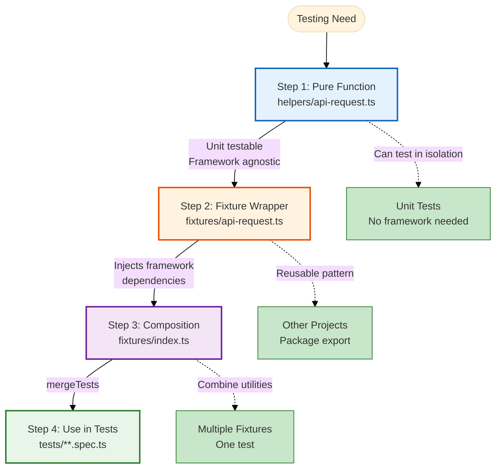

# Fixture Architecture Explained

Fixture architecture is TEA's pattern for building reusable, testable, and composable test utilities. The core principle: build pure functions first, wrap in framework fixtures second.

## Overview

**The Pattern:**
1. Write utility as pure function (unit-testable)
2. Wrap in framework fixture (Playwright, Cypress)
3. Compose fixtures with mergeTests (combine capabilities)
4. Package for reuse across projects

**Why this order?**
- Pure functions are easier to test
- Fixtures depend on framework (less portable)
- Composition happens at fixture level
- Reusability maximized

### Fixture Architecture Flow



**Benefits at Each Step:**
1. **Pure Function:** Testable, portable, reusable
2. **Fixture:** Framework integration, clean API
3. **Composition:** Combine capabilities, flexible
4. **Usage:** Simple imports, type-safe

## The Problem

### Framework-First Approach (Common Anti-Pattern)

```typescript
// ❌ Bad: Built as fixture from the start
export const test = base.extend({
  apiRequest: async ({ request }, use) => {
    await use(async (options) => {
      const response = await request.fetch(options.url, {
        method: options.method,
        data: options.data
      });

      if (!response.ok()) {
        throw new Error(`API request failed: ${response.status()}`);
      }

      return response.json();
    });
  }
});
```

**Problems:**
- Cannot unit test (requires Playwright context)
- Tied to framework (not reusable in other tools)
- Hard to compose with other fixtures
- Difficult to mock for testing the utility itself

### Copy-Paste Utilities

```typescript
// test-1.spec.ts
test('test 1', async ({ request }) => {
  const response = await request.post('/api/users', { data: {...} });
  const body = await response.json();
  if (!response.ok()) throw new Error('Failed');
  // ... repeated in every test
});

// test-2.spec.ts
test('test 2', async ({ request }) => {
  const response = await request.post('/api/users', { data: {...} });
  const body = await response.json();
  if (!response.ok()) throw new Error('Failed');
  // ... same code repeated
});
```

**Problems:**
- Code duplication (violates DRY)
- Inconsistent error handling
- Hard to update (change 50 tests)
- No shared behavior

## The Solution: Three-Step Pattern

### Step 1: Pure Function

```typescript
// helpers/api-request.ts

/**
 * Make API request with automatic error handling
 * Pure function - no framework dependencies
 */
export async function apiRequest({
  request,  // Passed in (dependency injection)
  method,
  url,
  data,
  headers = {}
}: ApiRequestParams): Promise<ApiResponse> {
  const response = await request.fetch(url, {
    method,
    data,
    headers
  });

  if (!response.ok()) {
    throw new Error(`API request failed: ${response.status()}`);
  }

  return {
    status: response.status(),
    body: await response.json()
  };
}

// ✅ Can unit test this function!
describe('apiRequest', () => {
  it('should throw on non-OK response', async () => {
    const mockRequest = {
      fetch: vi.fn().mockResolvedValue({ ok: () => false, status: () => 500 })
    };

    await expect(apiRequest({
      request: mockRequest,
      method: 'GET',
      url: '/api/test'
    })).rejects.toThrow('API request failed: 500');
  });
});
```

**Benefits:**
- Unit testable (mock dependencies)
- Framework-agnostic (works with any HTTP client)
- Easy to reason about (pure function)
- Portable (can use in Node scripts, CLI tools)

### Step 2: Fixture Wrapper

```typescript
// fixtures/api-request.ts
import { test as base } from '@playwright/test';
import { apiRequest as apiRequestFn } from '../helpers/api-request';

/**
 * Playwright fixture wrapping the pure function
 */
export const test = base.extend<{ apiRequest: typeof apiRequestFn }>({
  apiRequest: async ({ request }, use) => {
    // Inject framework dependency (request)
    await use((params) => apiRequestFn({ request, ...params }));
  }
});

export { expect } from '@playwright/test';
```

**Benefits:**
- Fixture provides framework context (request)
- Pure function handles logic
- Clean separation of concerns
- Can swap frameworks (Cypress, etc.) by changing wrapper only

### Step 3: Composition with mergeTests

```typescript
// fixtures/index.ts
import { mergeTests } from '@playwright/test';
import { test as apiRequestTest } from './api-request';
import { test as authSessionTest } from './auth-session';
import { test as logTest } from './log';

/**
 * Compose all fixtures into one test
 */
export const test = mergeTests(
  apiRequestTest,
  authSessionTest,
  logTest
);

export { expect } from '@playwright/test';
```

**Usage:**
```typescript
// tests/profile.spec.ts
import { test, expect } from '../support/fixtures';

test('should update profile', async ({ apiRequest, authToken, log }) => {
  log.info('Starting profile update test');

  // Use API request fixture (matches pure function signature)
  const { status, body } = await apiRequest({
    method: 'PATCH',
    url: '/api/profile',  
    data: { name: 'New Name' },  
    headers: { Authorization: `Bearer ${authToken}` }
  });

  expect(status).toBe(200);
  expect(body.name).toBe('New Name');

  log.info('Profile updated successfully');
});
```

**Note:** This example uses the vanilla pure function signature (`url`, `data`). Playwright Utils uses different parameter names (`path`, `body`). See [Integrate Playwright Utils](/docs/tea/how-to/customization/integrate-playwright-utils.md) for the utilities API.

**Note:** `authToken` requires auth-session fixture setup with provider configuration. See [auth-session documentation](https://seontechnologies.github.io/playwright-utils/auth-session.html).

**Benefits:**
- Use multiple fixtures in one test
- No manual composition needed
- Type-safe (TypeScript knows all fixture types)
- Clean imports

## How It Works in TEA

### TEA Generates This Pattern

When you run `framework` with `tea_use_playwright_utils: true`:

**TEA scaffolds:**
```
tests/
├── support/
│   ├── helpers/           # Pure functions
│   │   ├── api-request.ts
│   │   └── auth-session.ts
│   └── fixtures/          # Framework wrappers
│       ├── api-request.ts
│       ├── auth-session.ts
│       └── index.ts       # Composition
└── e2e/
    └── example.spec.ts      # Uses composed fixtures
```

### TEA Reviews Against This Pattern

When you run `test-review`:

**TEA checks:**
- Are utilities pure functions? ✓
- Are fixtures minimal wrappers? ✓
- Is composition used? ✓
- Can utilities be unit tested? ✓

## Package Export Pattern

### Make Fixtures Reusable Across Projects

**Option 1: Build Your Own (Vanilla)**
```json
// package.json
{
  "name": "@company/test-utils",
  "exports": {
    "./api-request": "./fixtures/api-request.ts",
    "./auth-session": "./fixtures/auth-session.ts",
    "./log": "./fixtures/log.ts"
  }
}
```

**Usage:**
```typescript
import { test as apiTest } from '@company/test-utils/api-request';
import { test as authTest } from '@company/test-utils/auth-session';
import { mergeTests } from '@playwright/test';

export const test = mergeTests(apiTest, authTest);
```

**Option 2: Use Playwright Utils (Recommended)**
```bash
npm install -D @seontechnologies/playwright-utils
```

**Usage:**
```typescript
import { test as base } from '@playwright/test';
import { mergeTests } from '@playwright/test';
import { test as apiRequestFixture } from '@seontechnologies/playwright-utils/api-request/fixtures';
import { createAuthFixtures } from '@seontechnologies/playwright-utils/auth-session';

const authFixtureTest = base.extend(createAuthFixtures());
export const test = mergeTests(apiRequestFixture, authFixtureTest);
// Production-ready utilities, battle-tested!
```

**Note:** Auth-session requires provider configuration. See [auth-session setup guide](https://seontechnologies.github.io/playwright-utils/auth-session.html).

**Why Playwright Utils:**
- Already built, tested, and maintained
- Consistent patterns across projects
- 11 utilities available (API, auth, network, logging, files)
- Community support and documentation
- Regular updates and improvements

**When to Build Your Own:**
- Company-specific patterns
- Custom authentication systems
- Unique requirements not covered by utilities

## Comparison: Good vs Bad Patterns

### Anti-Pattern: God Fixture

```typescript
// ❌ Bad: Everything in one fixture
export const test = base.extend({
  testUtils: async ({ page, request, context }, use) => {
    await use({
      // 50 different methods crammed into one fixture
      apiRequest: async (...) => { },
      login: async (...) => { },
      createUser: async (...) => { },
      deleteUser: async (...) => { },
      uploadFile: async (...) => { },
      // ... 45 more methods
    });
  }
});
```

**Problems:**
- Cannot test individual utilities
- Cannot compose (all-or-nothing)
- Cannot reuse specific utilities
- Hard to maintain (1000+ line file)

### Good Pattern: Single-Concern Fixtures

```typescript
// ✅ Good: One concern per fixture

// api-request.ts
export const test = base.extend({ apiRequest });

// auth-session.ts
export const test = base.extend({ authSession });

// log.ts
export const test = base.extend({ log });

// Compose as needed
import { mergeTests } from '@playwright/test';
export const test = mergeTests(apiRequestTest, authSessionTest, logTest);
```

**Benefits:**
- Each fixture is unit-testable
- Compose only what you need
- Reuse individual fixtures
- Easy to maintain (small files)

## Technical Implementation

For detailed fixture architecture patterns, see the knowledge base:
- [Knowledge Base Index - Architecture & Fixtures](/docs/tea/reference/knowledge-base.md)
- [Complete Knowledge Base Index](/docs/tea/reference/knowledge-base.md)

## When to Use This Pattern

### Always Use For:

**Reusable utilities:**
- API request helpers
- Authentication handlers
- File operations
- Network mocking

**Test infrastructure:**
- Shared fixtures across teams
- Packaged utilities (playwright-utils)
- Company-wide test standards

### Consider Skipping For:

**One-off test setup:**
```typescript
// Simple one-time setup - inline is fine
test.beforeEach(async ({ page }) => {
  await page.goto('/');
  await page.click('#accept-cookies');
});
```

**Test-specific helpers:**
```typescript
// Used in one test file only - keep local
function createTestUser(name: string) {
  return { name, email: `${name}@test.com` };
}
```

## Related Concepts

**Core TEA Concepts:**
- [Test Quality Standards](/docs/tea/explanation/test-quality-standards.md) - Quality standards fixtures enforce
- [Knowledge Base System](/docs/tea/explanation/knowledge-base-system.md) - Fixture patterns in knowledge base

**Technical Patterns:**
- [Network-First Patterns](/docs/tea/explanation/network-first-patterns.md) - Network fixtures explained
- [Risk-Based Testing](/docs/tea/explanation/risk-based-testing.md) - Fixture complexity matches risk

**Overview:**
- [TEA Overview](/docs/tea/explanation/tea-overview.md) - Fixture architecture in workflows
- [Testing as Engineering](/docs/tea/explanation/testing-as-engineering.md) - Why fixtures matter

## Practical Guides

**Setup Guides:**
- [How to Set Up Test Framework](/docs/tea/how-to/workflows/setup-test-framework.md) - TEA scaffolds fixtures
- [Integrate Playwright Utils](/docs/tea/how-to/customization/integrate-playwright-utils.md) - Production-ready fixtures

**Workflow Guides:**
- [How to Run ATDD](/docs/tea/how-to/workflows/run-atdd.md) - Using fixtures in tests
- [How to Run Automate](/docs/tea/how-to/workflows/run-automate.md) - Fixture composition examples

## Reference

- [TEA Command Reference](/docs/tea/reference/commands.md) - `framework` command
- [Knowledge Base Index](/docs/tea/reference/knowledge-base.md) - Fixture architecture fragments
- [Glossary](/docs/tea/glossary/index.md#test-architect-tea-concepts) - Fixture architecture term

---

Generated with [BMad Method](https://bmad-method.org) - TEA (Test Architect)
