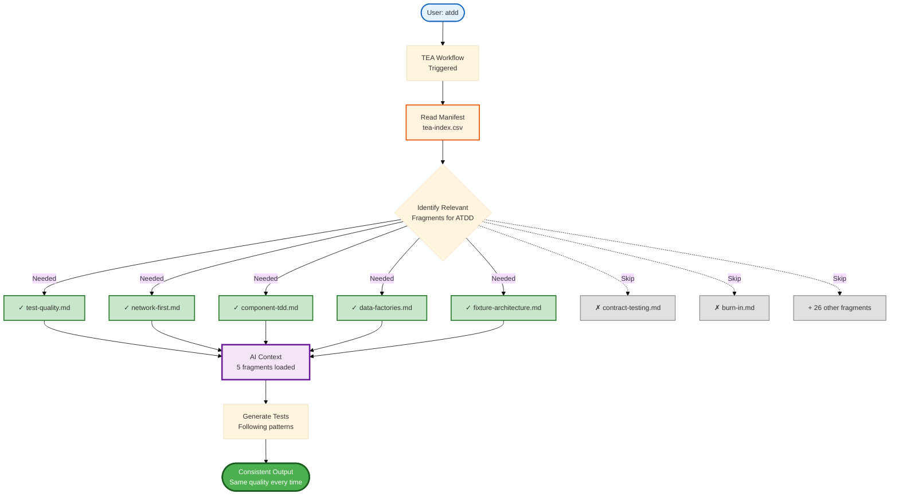

# Knowledge Base System Explained

TEA's knowledge base system is how context engineering works - automatically loading domain-specific standards into AI context so tests are consistently high-quality regardless of prompt variation.

## Overview

**The Problem:** AI without context produces inconsistent results.

**Traditional approach:**
```
User: "Write tests for login"
AI: [Generates tests with random quality]
- Sometimes uses hard waits
- Sometimes uses good patterns
- Inconsistent across sessions
- Quality depends on prompt
```

**TEA with knowledge base:**
```
User: "Write tests for login"
TEA: [Loads test-quality.md, network-first.md, auth-session.md]
TEA: [Generates tests following established patterns]
- Always uses network-first patterns
- Always uses proper fixtures
- Consistent across all sessions
- Quality independent of prompt
```

**Result:** Systematic quality, not random chance.

## The Problem

### Prompt-Driven Testing = Inconsistency

**Session 1:**
```
User: "Write tests for profile editing"

AI: [No context loaded]
// Generates test with hard waits
await page.waitForTimeout(3000);
```

**Session 2:**
```
User: "Write comprehensive tests for profile editing with best practices"

AI: [Still no systematic context]
// Generates test with some improvements, but still issues
await page.waitForSelector('.success', { timeout: 10000 });
```

**Session 3:**
```
User: "Write tests using network-first patterns and proper fixtures"

AI: [Better prompt, but still reinventing patterns]
// Generates test with network-first, but inconsistent with other tests
```

**Problem:** Quality depends on prompt engineering skill, no consistency.

### Knowledge Drift

Without a knowledge base:
- Team A uses pattern X
- Team B uses pattern Y
- Both work, but inconsistent
- No single source of truth
- Patterns drift over time

## The Solution: tea-index.csv Manifest

### How It Works

**1. Manifest Defines Fragments**

`src/bmm/testarch/tea-index.csv`:
```csv
id,name,description,tags,fragment_file
test-quality,Test Quality,Execution limits and isolation rules,quality;standards,knowledge/test-quality.md
network-first,Network-First Safeguards,Intercept-before-navigate workflow,network;stability,knowledge/network-first.md
fixture-architecture,Fixture Architecture,Composable fixture patterns,fixtures;architecture,knowledge/fixture-architecture.md
```

**2. Workflow Loads Relevant Fragments**

When user runs `atdd`:
```
TEA reads tea-index.csv
Identifies fragments needed for ATDD:
- test-quality.md (quality standards)
- network-first.md (avoid flakiness)
- component-tdd.md (TDD patterns)
- fixture-architecture.md (reusable fixtures)
- data-factories.md (test data)

Loads only these 5 fragments (not all 33)
Generates tests following these patterns
```

**3. Consistent Output**

Every time `atdd` runs:
- Same fragments loaded
- Same patterns applied
- Same quality standards
- Consistent test structure

**Result:** Tests look like they were written by the same expert, every time.

### Knowledge Base Loading Diagram



## Fragment Structure

### Anatomy of a Fragment

Each fragment follows this structure:

```markdown
# Fragment Name

## Principle
[One sentence - what is this pattern?]

## Rationale
[Why use this instead of alternatives?]
Why this pattern exists
Problems it solves
Benefits it provides

## Pattern Examples

### Example 1: Basic Usage
```code
[Runnable code example]
```
[Explanation of example]

### Example 2: Advanced Pattern
```code
[More complex example]
```
[Explanation]

## Anti-Patterns

### Don't Do This
```code
[Bad code example]
```
[Why it's bad]
[What breaks]

## Related Patterns
- [Link to related fragment]
```

<!-- markdownlint-disable MD024 -->
### Example: test-quality.md Fragment

```markdown
# Test Quality

## Principle
Tests must be deterministic, isolated, explicit, focused, and fast.

## Rationale
Tests that fail randomly, depend on each other, or take too long lose team trust.
[... detailed explanation ...]

## Pattern Examples

### Example 1: Deterministic Test
```typescript
// ✅ Wait for actual response, not timeout
const promise = page.waitForResponse(matcher);
await page.click('button');
await promise;
```

### Example 2: Isolated Test
```typescript
// ✅ Self-cleaning test
test('test', async ({ page }) => {
  const userId = await createTestUser();
  // ... test logic ...
  await deleteTestUser(userId);  // Cleanup
});
```

## Anti-Patterns

### Hard Waits
```typescript
// ❌ Non-deterministic
await page.waitForTimeout(3000);
```
[Why this causes flakiness]
```

**Total:** 24.5 KB, 12 code examples
<!-- markdownlint-enable MD024 -->

## How TEA Uses the Knowledge Base

### Workflow-Specific Loading

**Different workflows load different fragments:**

| Workflow | Fragments Loaded | Purpose |
|----------|-----------------|---------|
| `framework` | fixture-architecture, playwright-config, fixtures-composition | Infrastructure patterns |
| `test-design` | test-quality, test-priorities-matrix, risk-governance | Planning standards |
| `atdd` | test-quality, component-tdd, network-first, data-factories | TDD patterns |
| `automate` | test-quality, test-levels-framework, selector-resilience | Comprehensive generation |
| `test-review` | All quality/resilience/debugging fragments | Full audit patterns |
| `ci` | ci-burn-in, burn-in, selective-testing | CI/CD optimization |

**Benefit:** Only load what's needed (focused context, no bloat).

### Dynamic Fragment Selection

TEA doesn't load all 33 fragments at once:

```
User runs: atdd for authentication feature

TEA analyzes context:
- Feature type: Authentication
- Relevant fragments:
  - test-quality.md (always loaded)
  - auth-session.md (auth patterns)
  - network-first.md (avoid flakiness)
  - email-auth.md (if email-based auth)
  - data-factories.md (test users)

Skips:
- contract-testing.md (not relevant)
- feature-flags.md (not relevant)
- file-utils.md (not relevant)

Result: 5 relevant fragments loaded, 28 skipped
```

**Benefit:** Focused context = better results, lower token usage.

## Context Engineering in Practice

### Example: Consistent Test Generation

**Without Knowledge Base (Vanilla Playwright, Random Quality):**
```
Session 1: User runs atdd
AI: [Guesses patterns from general knowledge]

Generated:
test('api test', async ({ request }) => {
  const response = await request.get('/api/users');
  await page.waitForTimeout(2000);  // Hard wait
  const users = await response.json();
  // Random quality
});

Session 2: User runs atdd (different day)
AI: [Different random patterns]

Generated:
test('api test', async ({ request }) => {
  const response = await request.get('/api/users');
  const users = await response.json();
  // Better but inconsistent
});

Result: Inconsistent quality, random patterns
```

**With Knowledge Base (TEA + Playwright Utils):**
```
Session 1: User runs atdd
TEA: [Loads test-quality.md, network-first.md, api-request.md from tea-index.csv]

Generated:
import { test } from '@seontechnologies/playwright-utils/api-request/fixtures';

test('should fetch users', async ({ apiRequest }) => {
  const { status, body } = await apiRequest({
    method: 'GET',
    path: '/api/users'
  }).validateSchema(UsersSchema);  // Chained validation

  expect(status).toBe(200);
  expect(body).toBeInstanceOf(Array);
});

Session 2: User runs atdd (different day)
TEA: [Loads same fragments from tea-index.csv]

Generated: Identical pattern, same quality

Result: Systematic quality, established patterns (ALWAYS uses apiRequest utility when playwright-utils enabled)
```

**Key Difference:**
- **Without KB:** Random patterns, inconsistent APIs
- **With KB:** Always uses `apiRequest` utility, always validates schemas, always returns `{ status, body }`

### Example: Test Review Consistency

**Without Knowledge Base:**
```
test-review session 1:
"This test looks okay" [50 issues missed]

test-review session 2:
"This test has some issues" [Different issues flagged]

Result: Inconsistent feedback
```

**With Knowledge Base:**
```
test-review session 1:
[Loads all quality fragments]
Flags: 12 hard waits, 5 conditionals (based on test-quality.md)

test-review session 2:
[Loads same fragments]
Flags: Same issues with same explanations

Result: Consistent, reliable feedback
```

## Maintaining the Knowledge Base

### When to Add a Fragment

**Good reasons:**
- Pattern is used across multiple workflows
- Standard is non-obvious (needs documentation)
- Team asks "how should we handle X?" repeatedly
- New tool integration (e.g., new testing library)

**Bad reasons:**
- One-off pattern (document in test file instead)
- Obvious pattern (everyone knows this)
- Experimental (not proven yet)

### Fragment Quality Standards

**Good fragment:**
- Principle stated in one sentence
- Rationale explains why clearly
- 3+ pattern examples with code
- Anti-patterns shown (what not to do)
- Self-contained (minimal dependencies)

**Example size:** 10-30 KB optimal

### Updating Existing Fragments

**When to update:**
- Pattern evolved (better approach discovered)
- Tool updated (new Playwright API)
- Team feedback (pattern unclear)
- Bug in example code

**How to update:**
1. Edit fragment markdown file
2. Update examples
3. Test with affected workflows
4. Ensure no breaking changes

**No need to update tea-index.csv** unless description/tags change.

## Benefits of Knowledge Base System

### 1. Consistency

**Before:** Test quality varies by who wrote it
**After:** All tests follow same patterns (TEA-generated or reviewed)

### 2. Onboarding

**Before:** New team member reads 20 documents, asks 50 questions
**After:** New team member runs `atdd`, sees patterns in generated code, learns by example

### 3. Quality Gates

**Before:** "Is this test good?" → subjective opinion
**After:** `test-review` → objective score against knowledge base

### 4. Pattern Evolution

**Before:** Update tests manually across 100 files
**After:** Update fragment once, all new tests use new pattern

### 5. Cross-Project Reuse

**Before:** Reinvent patterns for each project
**After:** Same fragments across all BMad projects (consistency at scale)

## Comparison: With vs Without Knowledge Base

### Scenario: Testing Async Background Job

**Without Knowledge Base:**

Developer 1:
```typescript
// Uses hard wait
await page.click('button');
await page.waitForTimeout(10000);  // Hope job finishes
```

Developer 2:
```typescript
// Uses polling
await page.click('button');
for (let i = 0; i < 10; i++) {
  const status = await page.locator('.status').textContent();
  if (status === 'complete') break;
  await page.waitForTimeout(1000);
}
```

Developer 3:
```typescript
// Uses waitForSelector
await page.click('button');
await page.waitForSelector('.success', { timeout: 30000 });
```

**Result:** 3 different patterns, all suboptimal.

**With Knowledge Base (recurse.md fragment):**

All developers:
```typescript
import { test } from '@seontechnologies/playwright-utils/fixtures';

test('job completion', async ({ apiRequest, recurse }) => {
  // Start async job
  const { body: job } = await apiRequest({
    method: 'POST',
    path: '/api/jobs'
  });

  // Poll until complete (correct API: command, predicate, options)
  const result = await recurse(
    () => apiRequest({ method: 'GET', path: `/api/jobs/${job.id}` }),
    (response) => response.body.status === 'completed',  // response.body from apiRequest
    {
      timeout: 30000,
      interval: 2000,
      log: 'Waiting for job to complete'
    }
  );

  expect(result.body.status).toBe('completed');
});
```

**Result:** Consistent pattern using correct playwright-utils API (command, predicate, options).

## Technical Implementation

For details on the knowledge base index, see:
- [Knowledge Base Index](/docs/tea/reference/knowledge-base.md)
- [TEA Configuration](/docs/tea/reference/configuration.md)

## Related Concepts

**Core TEA Concepts:**
- [Test Quality Standards](/docs/tea/explanation/test-quality-standards.md) - Standards in knowledge base
- [Risk-Based Testing](/docs/tea/explanation/risk-based-testing.md) - Risk patterns in knowledge base
- [Engagement Models](/docs/tea/explanation/engagement-models.md) - Knowledge base across all models

**Technical Patterns:**
- [Fixture Architecture](/docs/tea/explanation/fixture-architecture.md) - Fixture patterns in knowledge base
- [Network-First Patterns](/docs/tea/explanation/network-first-patterns.md) - Network patterns in knowledge base

**Overview:**
- [TEA Overview](/docs/tea/explanation/tea-overview.md) - Knowledge base in workflows
- [Testing as Engineering](/docs/tea/explanation/testing-as-engineering.md) - **Foundation: Context engineering philosophy** (why knowledge base solves AI test problems)

## Practical Guides

**All Workflow Guides Use Knowledge Base:**
- [How to Run Test Design](/docs/tea/how-to/workflows/run-test-design.md)
- [How to Run ATDD](/docs/tea/how-to/workflows/run-atdd.md)
- [How to Run Automate](/docs/tea/how-to/workflows/run-automate.md)
- [How to Run Test Review](/docs/tea/how-to/workflows/run-test-review.md)

**Integration:**
- [Integrate Playwright Utils](/docs/tea/how-to/customization/integrate-playwright-utils.md) - PW-Utils in knowledge base

## Reference

- [Knowledge Base Index](/docs/tea/reference/knowledge-base.md) - Complete fragment index
- [TEA Command Reference](/docs/tea/reference/commands.md) - Which workflows load which fragments
- [TEA Configuration](/docs/tea/reference/configuration.md) - Config affects fragment loading
- [Glossary](/docs/tea/glossary/index.md#test-architect-tea-concepts) - Context engineering, knowledge fragment terms

---

Generated with [BMad Method](https://bmad-method.org) - TEA (Test Architect)
