# Risk-Based Testing Explained

Risk-based testing is TEA's core principle: testing depth scales with business impact. Instead of testing everything equally, focus effort where failures hurt most.

## Overview

Traditional testing approaches treat all features equally:
- Every feature gets same test coverage
- Same level of scrutiny regardless of impact
- No systematic prioritization
- Testing becomes checkbox exercise

**Risk-based testing asks:**
- What's the probability this will fail?
- What's the impact if it does fail?
- How much testing is appropriate for this risk level?

**Result:** Testing effort matches business criticality.

## The Problem

### Equal Testing for Unequal Risk

```markdown
Feature A: User login (critical path, millions of users)
Feature B: Export to PDF (nice-to-have, rarely used)

Traditional approach:
- Both get 10 tests
- Both get same review scrutiny
- Both take same development time

Problem: Wasting effort on low-impact features while under-testing critical paths.
```

### No Objective Prioritization

```markdown
PM: "We need more tests for checkout"
QA: "How many tests?"
PM: "I don't know... a lot?"
QA: "How do we know when we have enough?"
PM: "When it feels safe?"

Problem: Subjective decisions, no data, political debates.
```

## The Solution: Probability × Impact Scoring

### Risk Score = Probability × Impact

**Probability** (How likely to fail?)
- **1 (Low):** Stable, well-tested, simple logic
- **2 (Medium):** Moderate complexity, some unknowns
- **3 (High):** Complex, untested, many edge cases

**Impact** (How bad if it fails?)
- **1 (Low):** Minor inconvenience, few users affected
- **2 (Medium):** Degraded experience, workarounds exist
- **3 (High):** Critical path broken, business impact

**Score Range:** 1-9

#### Risk Scoring Matrix


**Legend:**
- 🔴 Red (Score 9): CRITICAL - Blocks release
- 🟠 Orange (Score 6-8): HIGH RISK - Mitigation required
- 🟡 Yellow (Score 4-5): MEDIUM - Mitigation recommended
- 🟢 Green (Score 1-3): LOW - Optional mitigation

### Scoring Examples

**Score 9 (Critical):**
```
Feature: Payment processing
Probability: 3 (complex third-party integration)
Impact: 3 (broken payments = lost revenue)
Score: 3 × 3 = 9

Action: Extensive testing required
- E2E tests for all payment flows
- API tests for all payment scenarios
- Error handling for all failure modes
- Security testing for payment data
- Load testing for high traffic
- Monitoring and alerts
```

**Score 1 (Low):**
```
Feature: Change profile theme color
Probability: 1 (simple UI toggle)
Impact: 1 (cosmetic only)
Score: 1 × 1 = 1

Action: Minimal testing
- One E2E smoke test
- Skip edge cases
- No API tests needed
```

**Score 6 (Medium-High):**
```
Feature: User profile editing
Probability: 2 (moderate complexity)
Impact: 3 (users can't update info)
Score: 2 × 3 = 6

Action: Focused testing
- E2E test for happy path
- API tests for CRUD operations
- Validation testing
- Skip low-value edge cases
```

## How It Works in TEA

### 1. Risk Categories

TEA assesses risk across 6 categories:

**TECH** - Technical debt, architecture fragility
```
Example: Migrating from REST to GraphQL
Probability: 3 (major architectural change)
Impact: 3 (affects all API consumers)
Score: 9 - Extensive integration testing required
```

**SEC** - Security vulnerabilities
```
Example: Adding OAuth integration
Probability: 2 (third-party dependency)
Impact: 3 (auth breach = data exposure)
Score: 6 - Security testing mandatory
```

**PERF** - Performance degradation
```
Example: Adding real-time notifications
Probability: 2 (WebSocket complexity)
Impact: 2 (slower experience)
Score: 4 - Load testing recommended
```

**DATA** - Data integrity, corruption
```
Example: Database migration
Probability: 2 (schema changes)
Impact: 3 (data loss unacceptable)
Score: 6 - Data validation tests required
```

**BUS** - Business logic errors
```
Example: Discount calculation
Probability: 2 (business rules complex)
Impact: 3 (wrong prices = revenue loss)
Score: 6 - Business logic tests mandatory
```

**OPS** - Operational issues
```
Example: Logging system update
Probability: 1 (straightforward)
Impact: 2 (debugging harder without logs)
Score: 2 - Basic smoke test sufficient
```

### 2. Test Priorities (P0-P3)

Risk scores inform test priorities (but aren't the only factor):

**P0 - Critical Path**
- **Risk Scores:** Typically 6-9 (high risk)
- **Other Factors:** Revenue impact, security-critical, regulatory compliance, frequent usage
- **Coverage Target:** 100%
- **Test Levels:** E2E + API
- **Example:** Login, checkout, payment processing

**P1 - High Value**
- **Risk Scores:** Typically 4-6 (medium-high risk)
- **Other Factors:** Core user journeys, complex logic, integration points
- **Coverage Target:** 90%
- **Test Levels:** API + selective E2E
- **Example:** Profile editing, search, filters

**P2 - Medium Value**
- **Risk Scores:** Typically 2-4 (medium risk)
- **Other Factors:** Secondary features, admin functionality, reporting
- **Coverage Target:** 50%
- **Test Levels:** API happy path only
- **Example:** Export features, advanced settings

**P3 - Low Value**
- **Risk Scores:** Typically 1-2 (low risk)
- **Other Factors:** Rarely used, nice-to-have, cosmetic
- **Coverage Target:** 20% (smoke test)
- **Test Levels:** E2E smoke test only
- **Example:** Theme customization, experimental features

**Note:** Priorities consider risk scores plus business context (usage frequency, user impact, etc.). See [Test Priorities Matrix](/docs/tea/reference/knowledge-base.md#quality-standards) for complete criteria.

### 3. Mitigation Plans

**Scores ≥6 require documented mitigation:**

```markdown
## Risk Mitigation

**Risk:** Payment integration failure (Score: 9)

**Mitigation Plan:**
- Create comprehensive test suite (20+ tests)
- Add payment sandbox environment
- Implement retry logic with idempotency
- Add monitoring and alerts
- Document rollback procedure

**Owner:** Backend team lead
**Deadline:** Before production deployment
**Status:** In progress
```

**Gate Rules:**
- **Score = 9** (Critical): Mandatory FAIL - blocks release without mitigation
- **Score 6-8** (High): Requires mitigation plan, becomes CONCERNS if incomplete
- **Score 4-5** (Medium): Mitigation recommended but not required
- **Score 1-3** (Low): No mitigation needed

## Comparison: Traditional vs Risk-Based

### Traditional Approach

```typescript
// Test everything equally
describe('User profile', () => {
  test('should display name');
  test('should display email');
  test('should display phone');
  test('should display address');
  test('should display bio');
  test('should display avatar');
  test('should display join date');
  test('should display last login');
  test('should display theme preference');
  test('should display language preference');
  // 10 tests for profile display (all equal priority)
});
```

**Problems:**
- Same effort for critical (name) vs trivial (theme)
- No guidance on what matters
- Wastes time on low-value tests

### Risk-Based Approach

```typescript
// Test based on risk

describe('User profile - Critical (P0)', () => {
  test('should display name and email');  // Score: 9 (identity critical)
  test('should allow editing name and email');
  test('should validate email format');
  test('should prevent unauthorized edits');
  // 4 focused tests on high-risk areas
});

describe('User profile - High Value (P1)', () => {
  test('should upload avatar');  // Score: 6 (users care about this)
  test('should update bio');
  // 2 tests for high-value features
});

// P2: Theme preference - single smoke test
// P3: Last login display - skip (read-only, low value)
```

**Benefits:**
- 6 focused tests vs 10 unfocused tests
- Effort matches business impact
- Clear priorities guide development
- No wasted effort on trivial features

## When to Use Risk-Based Testing

### Always Use For:

**Enterprise projects:**
- High stakes (revenue, compliance, security)
- Many features competing for test effort
- Need objective prioritization

**Large codebases:**
- Can't test everything exhaustively
- Need to focus limited QA resources
- Want data-driven decisions

**Regulated industries:**
- Must justify testing decisions
- Auditors want risk assessments
- Compliance requires evidence

### Consider Skipping For:

**Tiny projects:**
- 5 features total
- Can test everything thoroughly
- Risk scoring is overhead

**Prototypes:**
- Throw-away code
- Speed over quality
- Learning experiments

## Real-World Example

### Scenario: E-Commerce Checkout Redesign

**Feature:** Redesigning checkout flow from 5 steps to 3 steps

**Risk Assessment:**

| Component | Probability | Impact | Score | Priority | Testing |
|-----------|-------------|--------|-------|----------|---------|
| **Payment processing** | 3 | 3 | 9 | P0 | 15 E2E + 20 API tests |
| **Order validation** | 2 | 3 | 6 | P1 | 5 E2E + 10 API tests |
| **Shipping calculation** | 2 | 2 | 4 | P1 | 3 E2E + 8 API tests |
| **Promo code validation** | 2 | 2 | 4 | P1 | 2 E2E + 5 API tests |
| **Gift message** | 1 | 1 | 1 | P3 | 1 E2E smoke test |

**Test Budget:** 40 hours

**Allocation:**
- Payment (Score 9): 20 hours (50%)
- Order validation (Score 6): 8 hours (20%)
- Shipping (Score 4): 6 hours (15%)
- Promo codes (Score 4): 4 hours (10%)
- Gift message (Score 1): 2 hours (5%)

**Result:** 50% of effort on highest-risk feature (payment), proportional allocation for others.

### Without Risk-Based Testing:

**Equal allocation:** 8 hours per component = wasted effort on gift message, under-testing payment.

**Result:** Payment bugs slip through (critical), perfect testing of gift message (trivial).

## Mitigation Strategies by Risk Level

### Score 9: Mandatory Mitigation (Blocks Release)

```markdown
**Gate Impact:** FAIL - Cannot deploy without mitigation

**Actions:**
- Comprehensive test suite (E2E, API, security)
- Multiple test environments (dev, staging, prod-mirror)
- Load testing and performance validation
- Security audit and penetration testing
- Monitoring and alerting
- Rollback plan documented
- On-call rotation assigned

**Cannot deploy until score is mitigated below 9.**
```

### Score 6-8: Required Mitigation (Gate: CONCERNS)

```markdown
**Gate Impact:** CONCERNS - Can deploy with documented mitigation plan

**Actions:**
- Targeted test suite (happy path + critical errors)
- Test environment setup
- Monitoring plan
- Document mitigation and owners

**Can deploy with approved mitigation plan.**
```

### Score 4-5: Recommended Mitigation

```markdown
**Gate Impact:** Advisory - Does not affect gate decision

**Actions:**
- Basic test coverage
- Standard monitoring
- Document known limitations

**Can deploy, mitigation recommended but not required.**
```

### Score 1-3: Optional Mitigation

```markdown
**Gate Impact:** None

**Actions:**
- Smoke test if desired
- Feature flag for easy disable (optional)

**Can deploy without mitigation.**
```

## Technical Implementation

For detailed risk governance patterns, see the knowledge base:
- [Knowledge Base Index - Risk & Gates](/docs/tea/reference/knowledge-base.md)
- [TEA Command Reference - `test-design`](/docs/tea/reference/commands.md#test-design)

### Risk Scoring Matrix

TEA uses this framework in `test-design`:

```
           Impact
           1    2    3
      ┌────┬────┬────┐
    1 │ 1  │ 2  │ 3  │ Low risk
P   2 │ 2  │ 4  │ 6  │ Medium risk
r   3 │ 3  │ 6  │ 9  │ High risk
o     └────┴────┴────┘
b      Low  Med  High
```

### Gate Decision Rules

| Score | Mitigation Required | Gate Impact |
|-------|-------------------|-------------|
| **9** | Mandatory, blocks release | FAIL if no mitigation |
| **6-8** | Required, documented plan | CONCERNS if incomplete |
| **4-5** | Recommended | Advisory only |
| **1-3** | Optional | No impact |

#### Gate Decision Flow

```mermaid
%%{init: {'theme':'base', 'themeVariables': { 'fontSize':'14px'}}}%%
flowchart TD
    Start([Risk Assessment]) --> Score{Risk Score?}

    Score -->|Score = 9| Critical[CRITICAL RISK<br/>Score: 9]
    Score -->|Score 6-8| High[HIGH RISK<br/>Score: 6-8]
    Score -->|Score 4-5| Medium[MEDIUM RISK<br/>Score: 4-5]
    Score -->|Score 1-3| Low[LOW RISK<br/>Score: 1-3]

    Critical --> HasMit9{Mitigation<br/>Plan?}
    HasMit9 -->|Yes| Concerns9[CONCERNS ⚠️<br/>Can deploy with plan]
    HasMit9 -->|No| Fail[FAIL ❌<br/>Blocks release]

    High --> HasMit6{Mitigation<br/>Plan?}
    HasMit6 -->|Yes| Pass6[PASS ✅<br/>or CONCERNS ⚠️]
    HasMit6 -->|No| Concerns6[CONCERNS ⚠️<br/>Document plan needed]

    Medium --> Advisory[Advisory Only<br/>No gate impact]
    Low --> NoAction[No Action<br/>Proceed]

    style Critical fill:#f44336,stroke:#b71c1c,stroke-width:3px,color:#fff
    style Fail fill:#d32f2f,stroke:#b71c1c,stroke-width:3px,color:#fff
    style High fill:#ff9800,stroke:#e65100,stroke-width:2px,color:#000
    style Concerns9 fill:#ffc107,stroke:#f57f17,stroke-width:2px,color:#000
    style Concerns6 fill:#ffc107,stroke:#f57f17,stroke-width:2px,color:#000
    style Pass6 fill:#4caf50,stroke:#1b5e20,stroke-width:2px,color:#fff
    style Medium fill:#fff9c4,stroke:#f57f17,stroke-width:1px,color:#000
    style Low fill:#c8e6c9,stroke:#2e7d32,stroke-width:1px,color:#000
    style Advisory fill:#e8f5e9,stroke:#2e7d32,stroke-width:1px,color:#000
    style NoAction fill:#e8f5e9,stroke:#2e7d32,stroke-width:1px,color:#000
```



## Common Misconceptions

### "Risk-based = Less Testing"

**Wrong:** Risk-based testing often means MORE testing where it matters.

**Example:**
- Traditional: 50 tests spread equally
- Risk-based: 70 tests focused on P0/P1 (more total, better allocated)

### "Low Priority = Skip Testing"

**Wrong:** P3 still gets smoke tests.

**Correct:**
- P3: Smoke test (feature works at all)
- P2: Happy path (feature works correctly)
- P1: Happy path + errors
- P0: Comprehensive (all scenarios)

### "Risk Scores Are Permanent"

**Wrong:** Risk changes over time.

**Correct:**
- Initial launch: Payment is Score 9 (untested integration)
- After 6 months: Payment is Score 6 (proven in production)
- Re-assess risk quarterly

## Related Concepts

**Core TEA Concepts:**
- [Test Quality Standards](/docs/tea/explanation/test-quality-standards.md) - Quality complements risk assessment
- [Engagement Models](/docs/tea/explanation/engagement-models.md) - When risk-based testing matters most
- [Knowledge Base System](/docs/tea/explanation/knowledge-base-system.md) - How risk patterns are loaded

**Technical Patterns:**
- [Fixture Architecture](/docs/tea/explanation/fixture-architecture.md) - Building risk-appropriate test infrastructure
- [Network-First Patterns](/docs/tea/explanation/network-first-patterns.md) - Quality patterns for high-risk features

**Overview:**
- [TEA Overview](/docs/tea/explanation/tea-overview.md) - Risk assessment in TEA lifecycle
- [Testing as Engineering](/docs/tea/explanation/testing-as-engineering.md) - Design philosophy

## Practical Guides

**Workflow Guides:**
- [How to Run Test Design](/docs/tea/how-to/workflows/run-test-design.md) - Apply risk scoring
- [How to Run Trace](/docs/tea/how-to/workflows/run-trace.md) - Gate decisions based on risk
- [How to Run NFR Assessment](/docs/tea/how-to/workflows/run-nfr-assess.md) - NFR risk assessment

**Use-Case Guides:**
- [Running TEA for Enterprise](/docs/tea/how-to/brownfield/use-tea-for-enterprise.md) - Enterprise risk management

## Reference

- [TEA Command Reference](/docs/tea/reference/commands.md) - `test-design`, `nfr-assess`, `trace`
- [Knowledge Base Index](/docs/tea/reference/knowledge-base.md) - Risk governance fragments
- [Glossary](/docs/tea/glossary/index.md#test-architect-tea-concepts) - Risk-based testing term

---

Generated with [BMad Method](https://bmad-method.org) - TEA (Test Architect)
