The Test Architect (TEA) is a specialized agent focused on quality strategy, test automation, and release gates in BMad Method projects.

:::tip[Design Philosophy]
TEA was built to solve AI-generated tests that rot in review. For the problem statement and design principles, see [Testing as Engineering](/docs/tea/explanation/testing-as-engineering.md). For setup, see [Setup Test Framework](/docs/tea/how-to/workflows/setup-test-framework.md).
:::

## Overview

- **Persona:** Murat, Master Test Architect and Quality Advisor focused on risk-based testing, fixture architecture, ATDD, and CI/CD governance.
- **Mission:** Deliver actionable quality strategies, automation coverage, and gate decisions that scale with project complexity and compliance demands.
- **Use When:** BMad Method or Enterprise track projects, integration risk is non-trivial, brownfield regression risk exists, or compliance/NFR evidence is required. (Quick Flow projects typically don't require TEA)

## Choose Your TEA Engagement Model

BMad does not mandate TEA. There are five valid ways to use it (or skip it). Pick one intentionally.

1. **No TEA**
   - Skip all TEA workflows. Use your existing team testing approach.

2. **TEA Solo (Standalone)**
   - Use TEA on a non-BMad project. Bring your own requirements, acceptance criteria, and environments.
   - Typical sequence: `test-design` (system or epic) -> `atdd` and/or `automate` -> optional `test-review` -> `trace` for coverage and gate decisions.
   - Run `framework` or `ci` only if you want TEA to scaffold the harness or pipeline; they work best after you decide the stack/architecture.

**TEA Lite (Beginner Approach):**
   - Simplest way to use TEA - just use `automate` to test existing features.
   - Perfect for learning TEA fundamentals in 30 minutes.
   - See [TEA Lite Quickstart Tutorial](/docs/tea/tutorials/tea-lite-quickstart.md).

3. **Integrated: Greenfield - BMad Method (Simple/Standard Work)**
   - Phase 3: system-level `test-design`, then `framework` and `ci`.
   - Phase 4: per-epic `test-design`, optional `atdd`, then `automate` and optional `test-review`.
   - Gate (Phase 2): `trace`.

4. **Integrated: Brownfield - BMad Method or Enterprise (Simple or Complex)**
   - Phase 2: baseline `trace`.
   - Phase 3: system-level `test-design`, then `framework` and `ci`.
   - Phase 4: per-epic `test-design` focused on regression and integration risks.
   - Gate (Phase 2): `trace`; `nfr-assess` (if not done earlier).
   - For brownfield BMad Method, follow the same flow with `nfr-assess` optional.

5. **Integrated: Greenfield - Enterprise Method (Enterprise/Compliance Work)**
   - Phase 2: `nfr-assess`.
   - Phase 3: system-level `test-design`, then `framework` and `ci`.
   - Phase 4: per-epic `test-design`, plus `atdd`/`automate`/`test-review`.
   - Gate (Phase 2): `trace`; archive artifacts as needed.

If you are unsure, default to the integrated path for your track and adjust later.

## TEA Command Catalog

| Command        | Primary Outputs                                                                               | Notes                                                | With Playwright MCP Enhancements                                                                                                     |
| -------------- | --------------------------------------------------------------------------------------------- | ---------------------------------------------------- | ------------------------------------------------------------------------------------------------------------------------------------ |
| `framework`    | Playwright/Cypress scaffold, `.env.example`, `.nvmrc`, sample specs                           | Use when no production-ready harness exists          | -                                                                                                                                    |
| `ci`           | CI workflow, selective test scripts, secrets checklist                                        | Platform-aware (GitHub Actions default)              | -                                                                                                                                    |
| `test-design`  | Combined risk assessment, mitigation plan, and coverage strategy                              | Risk scoring + optional exploratory mode             | **+ Exploratory**: Interactive UI discovery with browser automation (uncover actual functionality)                                   |
| `atdd`         | Failing acceptance tests + implementation checklist                                           | TDD red phase + optional recording mode              | **+ Recording**: UI selectors verified with live browser; API tests benefit from trace analysis                                      |
| `automate`     | Prioritized specs, fixtures, README/script updates, DoD summary                               | Optional healing/recording, avoid duplicate coverage | **+ Healing**: Visual debugging + trace analysis for test fixes; **+ Recording**: Verified selectors (UI) + network inspection (API) |
| `test-review`  | Test quality review report with 0-100 score, violations, fixes                                | Reviews tests against knowledge base patterns        | -                                                                                                                                    |
| `nfr-assess`   | NFR assessment report with actions                                                            | Focus on security/performance/reliability            | -                                                                                                                                    |
| `trace`        | Phase 1: Coverage matrix, recommendations. Phase 2: Gate decision (PASS/CONCERNS/FAIL/WAIVED) | Two-phase workflow: traceability + gate decision     | -                                                                                                                                    |

## TEA Workflow Lifecycle

**Phase Numbering Note:** BMad uses a 4-phase methodology with optional Phase 1 and a documentation prerequisite:

- **Documentation** (Optional for brownfield): Prerequisite using `document-project`
- **Phase 1** (Optional): Discovery/Analysis (`brainstorm`, `research`, `product-brief`)
- **Phase 2** (Required): Planning (`prd` creates PRD with FRs/NFRs)
- **Phase 3** (Track-dependent): Solutioning (`architecture` → `test-design` (system-level) → `create-epics-and-stories` → TEA: `framework`, `ci` → `implementation-readiness`)
- **Phase 4** (Required): Implementation (`sprint-planning` → per-epic: `test-design` → per-story: dev workflows)

TEA integrates into the BMad development lifecycle during Solutioning (Phase 3) and Implementation (Phase 4):

```mermaid
%%{init: {'theme':'base', 'themeVariables': { 'primaryColor':'#fff','primaryTextColor':'#000','primaryBorderColor':'#000','lineColor':'#000','secondaryColor':'#fff','tertiaryColor':'#fff','fontSize':'16px','fontFamily':'arial'}}}%%
graph TB
    subgraph Phase2["<b>Phase 2: PLANNING</b>"]
        PM["<b>PM: prd (creates PRD with FRs/NFRs)</b>"]
        PlanNote["<b>Business requirements phase</b>"]
        NFR2["<b>TEA: nfr-assess (optional, enterprise)</b>"]
        PM -.-> NFR2
        NFR2 -.-> PlanNote
        PM -.-> PlanNote
    end

    subgraph Phase3["<b>Phase 3: SOLUTIONING</b>"]
        Architecture["<b>Architect: architecture</b>"]
        EpicsStories["<b>PM/Architect: create-epics-and-stories</b>"]
        TestDesignSys["<b>TEA: test-design (system-level)</b>"]
        Framework["<b>TEA: framework (optional if needed)</b>"]
        CI["<b>TEA: ci (optional if needed)</b>"]
        GateCheck["<b>Architect: implementation-readiness</b>"]
        Architecture --> EpicsStories
        Architecture --> TestDesignSys
        TestDesignSys --> Framework
        EpicsStories --> Framework
        Framework --> CI
        CI --> GateCheck
        Phase3Note["<b>Epics created AFTER architecture,</b><br/><b>then system-level test design and test infrastructure setup</b>"]
        EpicsStories -.-> Phase3Note
    end

    subgraph Phase4["<b>Phase 4: IMPLEMENTATION - Per Epic Cycle</b>"]
        SprintPlan["<b>SM: sprint-planning</b>"]
        TestDesign["<b>TEA: test-design (per epic)</b>"]
        CreateStory["<b>SM: create-story</b>"]
        ATDD["<b>TEA: atdd (optional, before dev)</b>"]
        DevImpl["<b>DEV: implements story</b>"]
        Automate["<b>TEA: automate</b>"]
        TestReview1["<b>TEA: test-review (optional)</b>"]
        Trace1["<b>TEA: trace (refresh coverage)</b>"]

        SprintPlan --> TestDesign
        TestDesign --> CreateStory
        CreateStory --> ATDD
        ATDD --> DevImpl
        DevImpl --> Automate
        Automate --> TestReview1
        TestReview1 --> Trace1
        Trace1 -.->|next story| CreateStory
        TestDesignNote["<b>Test design: 'How do I test THIS epic?'</b><br/>Creates test-design-epic-N.md per epic"]
        TestDesign -.-> TestDesignNote
    end

    subgraph Gate["<b>EPIC/RELEASE GATE</b>"]
        NFR["<b>TEA: nfr-assess (if not done earlier)</b>"]
        TestReview2["<b>TEA: test-review (final audit, optional)</b>"]
        TraceGate["<b>TEA: trace - Phase 2: Gate</b>"]
        GateDecision{"<b>Gate Decision</b>"}

        NFR --> TestReview2
        TestReview2 --> TraceGate
        TraceGate --> GateDecision
        GateDecision -->|PASS| Pass["<b>PASS ✅</b>"]
        GateDecision -->|CONCERNS| Concerns["<b>CONCERNS ⚠️</b>"]
        GateDecision -->|FAIL| Fail["<b>FAIL ❌</b>"]
        GateDecision -->|WAIVED| Waived["<b>WAIVED ⏭️</b>"]
    end

    Phase2 --> Phase3
    Phase3 --> Phase4
    Phase4 --> Gate

    style Phase2 fill:#bbdefb,stroke:#0d47a1,stroke-width:3px,color:#000
    style Phase3 fill:#c8e6c9,stroke:#2e7d32,stroke-width:3px,color:#000
    style Phase4 fill:#e1bee7,stroke:#4a148c,stroke-width:3px,color:#000
    style Gate fill:#ffe082,stroke:#f57c00,stroke-width:3px,color:#000
    style Pass fill:#4caf50,stroke:#1b5e20,stroke-width:3px,color:#000
    style Concerns fill:#ffc107,stroke:#f57f17,stroke-width:3px,color:#000
    style Fail fill:#f44336,stroke:#b71c1c,stroke-width:3px,color:#000
    style Waived fill:#9c27b0,stroke:#4a148c,stroke-width:3px,color:#000
```



**TEA workflows:** `framework` and `ci` run once in Phase 3 after architecture. `test-design` is **dual-mode**:

- **System-level (Phase 3):** Run immediately after architecture/ADR drafting to produce TWO documents: `test-design-architecture.md` (for Architecture/Dev teams: testability gaps, ASRs, NFR requirements) + `test-design-qa.md` (for QA team: test execution recipe, coverage plan, Sprint 0 setup). Feeds the implementation-readiness gate.
- **Epic-level (Phase 4):** Run per-epic to produce `test-design-epic-N.md` (risk, priorities, coverage plan).

The Quick Flow track skips Phases 1 and 3.
BMad Method and Enterprise use all phases based on project needs.
When an ADR or architecture draft is produced, run `test-design` in **system-level** mode before the implementation-readiness gate. This ensures the ADR has an attached testability review and ADR → test mapping. Keep the test-design updated if ADRs change.

## Why TEA Is Different from Other BMM Agents

TEA spans multiple phases (Phase 3, Phase 4, and the release gate). Most BMM agents operate in a single phase. That multi-phase role is paired with a dedicated testing knowledge base so standards stay consistent across projects.

### TEA's 8 Workflows Across Phases

| Phase       | TEA Workflows                                             | Frequency        | Purpose                                                 |
| ----------- | --------------------------------------------------------- | ---------------- | ------------------------------------------------------- |
| **Phase 2** | (none)                                                    | -                | Planning phase - PM defines requirements                |
| **Phase 3** | `test-design` (system-level), `framework`, `ci`           | Once per project | System testability review and test infrastructure setup |
| **Phase 4** | `test-design`, `atdd`, `automate`, `test-review`, `trace` | Per epic/story   | Test planning per epic, then per-story testing          |
| **Release** | `nfr-assess`, `trace` (Phase 2: gate)                     | Per epic/release | Go/no-go decision                                       |

**Note**: `trace` is a two-phase workflow: Phase 1 (traceability) + Phase 2 (gate decision). This reduces cognitive load while maintaining natural workflow.

### Why TEA Requires Its Own Knowledge Base

TEA uniquely requires:

- **Extensive domain knowledge**: Test patterns, CI/CD, fixtures, and quality practices
- **Cross-cutting concerns**: Standards that apply across all BMad projects (not just PRDs or stories)
- **Optional integrations**: Playwright-utils and MCP enhancements

This architecture lets TEA maintain consistent, production-ready testing patterns while operating across multiple phases.

## Track Cheat Sheets (Condensed)

These cheat sheets map TEA workflows to the **BMad Method and Enterprise tracks** across the **4-Phase Methodology** (Phase 1: Analysis, Phase 2: Planning, Phase 3: Solutioning, Phase 4: Implementation).

**Note:** The Quick Flow track typically doesn't require TEA (covered in Overview). These cheat sheets focus on BMad Method and Enterprise tracks where TEA adds value.

**Legend for Track Deltas:**

- ➕ = New workflow or phase added (doesn't exist in baseline)
- 🔄 = Modified focus (same workflow, different emphasis or purpose)
- 📦 = Additional output or archival requirement

### Greenfield - BMad Method (Simple/Standard Work)

**Planning Track:** BMad Method (PRD + Architecture)
**Use Case:** New projects with standard complexity

| Workflow Stage             | Test Architect                                                    | Dev / Team                                                                          | Outputs                                                    |
| -------------------------- | ----------------------------------------------------------------- | ----------------------------------------------------------------------------------- | ---------------------------------------------------------- |
| **Phase 1**: Discovery     | -                                                                 | Analyst `product-brief` (optional)                                                 | `product-brief.md`                                         |
| **Phase 2**: Planning      | -                                                                 | PM `prd` (creates PRD with FRs/NFRs)                                               | PRD with functional/non-functional requirements            |
| **Phase 3**: Solutioning   | Run `framework`, `ci` AFTER architecture and epic creation        | Architect `architecture`, `create-epics-and-stories`, `implementation-readiness`   | Architecture, epics/stories, test scaffold, CI pipeline    |
| **Phase 4**: Sprint Start  | -                                                                 | SM `sprint-planning`                                                               | Sprint status file with all epics and stories              |
| **Phase 4**: Epic Planning | Run `test-design` for THIS epic (per-epic test plan)              | Review epic scope                                                                  | `test-design-epic-N.md` with risk assessment and test plan |
| **Phase 4**: Story Dev     | (Optional) `atdd` before dev, then `automate` after               | SM `create-story`, DEV implements                                                  | Tests, story implementation                                |
| **Phase 4**: Story Review  | Execute `test-review` (optional), re-run `trace`                  | Address recommendations, update code/tests                                         | Quality report, refreshed coverage matrix                  |
| **Phase 4**: Release Gate  | (Optional) `test-review` for final audit, Run `trace` (Phase 2)   | Confirm Definition of Done, share release notes                                    | Quality audit, Gate YAML + release summary                 |

**Key notes:**
- Run `framework` and `ci` once in Phase 3 after architecture.
- Run `test-design` per epic in Phase 4; use `atdd` before dev when helpful.
- Use `trace` for gate decisions; `test-review` is an optional audit.

### Brownfield - BMad Method or Enterprise (Simple or Complex)

**Planning Tracks:** BMad Method or Enterprise Method
**Use Case:** Existing codebases: simple additions (BMad Method) or complex enterprise requirements (Enterprise Method)

**🔄 Brownfield Deltas from Greenfield:**

- ➕ Documentation (Prerequisite) - Document existing codebase if undocumented
- ➕ Phase 2: `trace` - Baseline existing test coverage before planning
- 🔄 Phase 4: `test-design` - Focus on regression hotspots and brownfield risks
- 🔄 Phase 4: Story Review - May include `nfr-assess` if not done earlier

| Workflow Stage                    | Test Architect                                                              | Dev / Team                                                                          | Outputs                                                                |
| --------------------------------- | --------------------------------------------------------------------------- | ----------------------------------------------------------------------------------- | ---------------------------------------------------------------------- |
| **Documentation**: Prerequisite ➕ | -                                                                           | Analyst `document-project` (if undocumented)                                       | Comprehensive project documentation                                    |
| **Phase 1**: Discovery            | -                                                                           | Analyst/PM/Architect rerun planning workflows                                      | Updated planning artifacts in `{output_folder}`                        |
| **Phase 2**: Planning             | Run ➕ `trace` (baseline coverage)                                           | PM `prd` (creates PRD with FRs/NFRs)                                               | PRD with FRs/NFRs, ➕ coverage baseline                                 |
| **Phase 3**: Solutioning          | Run `framework`, `ci` AFTER architecture and epic creation                  | Architect `architecture`, `create-epics-and-stories`, `implementation-readiness`   | Architecture, epics/stories, test framework, CI pipeline               |
| **Phase 4**: Sprint Start         | -                                                                           | SM `sprint-planning`                                                               | Sprint status file with all epics and stories                          |
| **Phase 4**: Epic Planning        | Run `test-design` for THIS epic 🔄 (regression hotspots)                     | Review epic scope and brownfield risks                                             | `test-design-epic-N.md` with brownfield risk assessment and mitigation |
| **Phase 4**: Story Dev            | (Optional) `atdd` before dev, then `automate` after                         | SM `create-story`, DEV implements                                                  | Tests, story implementation                                            |
| **Phase 4**: Story Review         | Apply `test-review` (optional), re-run `trace`, ➕ `nfr-assess` if needed    | Resolve gaps, update docs/tests                                                    | Quality report, refreshed coverage matrix, NFR report                  |
| **Phase 4**: Release Gate         | (Optional) `test-review` for final audit, Run `trace` (Phase 2)             | Capture sign-offs, share release notes                                             | Quality audit, Gate YAML + release summary                             |

**Key notes:**
- Start with `trace` in Phase 2 to baseline coverage.
- Focus `test-design` on regression hotspots and integration risk.
- Run `nfr-assess` before the gate if it wasn't done earlier.

### Greenfield - Enterprise Method (Enterprise/Compliance Work)

**Planning Track:** Enterprise Method (BMad Method + extended security/devops/test strategies)
**Use Case:** New enterprise projects with compliance, security, or complex regulatory requirements

**🏢 Enterprise Deltas from BMad Method:**

- ➕ Phase 1: `research` - Domain and compliance research (recommended)
- ➕ Phase 2: `nfr-assess` - Capture NFR requirements early (security/performance/reliability)
- 🔄 Phase 4: `test-design` - Enterprise focus (compliance, security architecture alignment)
- 📦 Release Gate - Archive artifacts and compliance evidence for audits

| Workflow Stage             | Test Architect                                                          | Dev / Team                                                                          | Outputs                                                            |
| -------------------------- | ----------------------------------------------------------------------- | ----------------------------------------------------------------------------------- | ------------------------------------------------------------------ |
| **Phase 1**: Discovery     | -                                                                       | Analyst ➕ `research`, `product-brief`                                               | Domain research, compliance analysis, product brief                |
| **Phase 2**: Planning      | Run ➕ `nfr-assess`                                                      | PM `prd` (creates PRD with FRs/NFRs), UX `create-ux-design`                         | Enterprise PRD with FRs/NFRs, UX design, ➕ NFR documentation       |
| **Phase 3**: Solutioning   | Run `framework`, `ci` AFTER architecture and epic creation              | Architect `architecture`, `create-epics-and-stories`, `implementation-readiness`   | Architecture, epics/stories, test framework, CI pipeline           |
| **Phase 4**: Sprint Start  | -                                                                       | SM `sprint-planning`                                                               | Sprint plan with all epics                                         |
| **Phase 4**: Epic Planning | Run `test-design` for THIS epic 🔄 (compliance focus)                    | Review epic scope and compliance requirements                                      | `test-design-epic-N.md` with security/performance/compliance focus |
| **Phase 4**: Story Dev     | (Optional) `atdd`, `automate`, `test-review`, `trace` per story         | SM `create-story`, DEV implements                                                  | Tests, fixtures, quality reports, coverage matrices                |
| **Phase 4**: Release Gate  | Final `test-review` audit, Run `trace` (Phase 2), 📦 archive artifacts   | Capture sign-offs, 📦 compliance evidence                                           | Quality audit, updated assessments, gate YAML, 📦 audit trail       |

**Key notes:**
- Run `nfr-assess` early in Phase 2.
- `test-design` emphasizes compliance, security, and performance alignment.
- Archive artifacts at the release gate for audits.

**Related how-to guides:**
- [How to Run Test Design](/docs/tea/how-to/workflows/run-test-design.md)
- [How to Set Up a Test Framework](/docs/tea/how-to/workflows/setup-test-framework.md)
- [How to Run ATDD](/docs/tea/how-to/workflows/run-atdd.md)
- [How to Run Automate](/docs/tea/how-to/workflows/run-automate.md)
- [How to Run Test Review](/docs/tea/how-to/workflows/run-test-review.md)
- [How to Set Up CI Pipeline](/docs/tea/how-to/workflows/setup-ci.md)
- [How to Run NFR Assessment](/docs/tea/how-to/workflows/run-nfr-assess.md)
- [How to Run Trace](/docs/tea/how-to/workflows/run-trace.md)

## Deep Dive Concepts

Want to understand TEA principles and patterns in depth?

**Core Principles:**
- [Risk-Based Testing](/docs/tea/explanation/risk-based-testing.md) - Probability × impact scoring, P0-P3 priorities
- [Test Quality Standards](/docs/tea/explanation/test-quality-standards.md) - Definition of Done, determinism, isolation
- [Knowledge Base System](/docs/tea/explanation/knowledge-base-system.md) - Context engineering with tea-index.csv

**Technical Patterns:**
- [Fixture Architecture](/docs/tea/explanation/fixture-architecture.md) - Pure function → fixture → composition
- [Network-First Patterns](/docs/tea/explanation/network-first-patterns.md) - Eliminating flakiness with intercept-before-navigate

**Engagement & Strategy:**
- [Engagement Models](/docs/tea/explanation/engagement-models.md) - TEA Lite, TEA Solo, TEA Integrated (5 models explained)

**Philosophy:**
- [Testing as Engineering](/docs/tea/explanation/testing-as-engineering.md) - **Start here to understand WHY TEA exists** - The problem with AI-generated tests and TEA's three-part solution

## Optional Integrations

### Playwright Utils (`@seontechnologies/playwright-utils`)

Production-ready fixtures and utilities that enhance TEA workflows.

- Install: `npm install -D @seontechnologies/playwright-utils`
> Note: Playwright Utils is enabled via the installer. Only set `tea_use_playwright_utils` in `_bmad/bmm/config.yaml` if you need to override the installer choice.
- Impacts: `framework`, `atdd`, `automate`, `test-review`, `ci`
- Utilities include: api-request, auth-session, network-recorder, intercept-network-call, recurse, log, file-utils, burn-in, network-error-monitor, fixtures-composition

### Playwright MCP Enhancements

Live browser verification for test design and automation.

**Two Playwright MCP servers** (actively maintained, continuously updated):

- `playwright` - Browser automation (`npx @playwright/mcp@latest`)
- `playwright-test` - Test runner with failure analysis (`npx playwright run-test-mcp-server`)

**Configuration example**:

```json
{
  "mcpServers": {
    "playwright": {
      "command": "npx",
      "args": ["@playwright/mcp@latest"]
    },
    "playwright-test": {
      "command": "npx",
      "args": ["playwright", "run-test-mcp-server"]
    }
  }
}
```

- Helps `test-design` validate actual UI behavior.
- Helps `atdd` and `automate` verify selectors against the live DOM.
- Enhances healing with `browser_snapshot`, console, network, and locator tools.

**To disable**: set `tea_use_mcp_enhancements: false` in `_bmad/bmm/config.yaml` or remove MCPs from IDE config.

---

## Complete TEA Documentation Navigation

### Start Here

**New to TEA? Start with the tutorial:**
- [TEA Lite Quickstart Tutorial](/docs/tea/tutorials/tea-lite-quickstart.md) - 30-minute beginner guide using TodoMVC

### Workflow Guides (Task-Oriented)

**All 8 TEA workflows with step-by-step instructions:**
1. [How to Set Up a Test Framework with TEA](/docs/tea/how-to/workflows/setup-test-framework.md) - Scaffold Playwright or Cypress
2. [How to Set Up CI Pipeline with TEA](/docs/tea/how-to/workflows/setup-ci.md) - Configure CI/CD with selective testing
3. [How to Run Test Design with TEA](/docs/tea/how-to/workflows/run-test-design.md) - Risk-based test planning (system or epic)
4. [How to Run ATDD with TEA](/docs/tea/how-to/workflows/run-atdd.md) - Generate failing tests before implementation
5. [How to Run Automate with TEA](/docs/tea/how-to/workflows/run-automate.md) - Expand test coverage after implementation
6. [How to Run Test Review with TEA](/docs/tea/how-to/workflows/run-test-review.md) - Audit test quality (0-100 scoring)
7. [How to Run NFR Assessment with TEA](/docs/tea/how-to/workflows/run-nfr-assess.md) - Validate non-functional requirements
8. [How to Run Trace with TEA](/docs/tea/how-to/workflows/run-trace.md) - Coverage traceability + gate decisions

### Customization & Integration

**Optional enhancements to TEA workflows:**
- [Integrate Playwright Utils](/docs/tea/how-to/customization/integrate-playwright-utils.md) - Production-ready fixtures and 9 utilities
- [Enable TEA MCP Enhancements](/docs/tea/how-to/customization/enable-tea-mcp-enhancements.md) - Live browser verification, visual debugging

### Use-Case Guides

**Specialized guidance for specific contexts:**
- [Using TEA with Existing Tests (Brownfield)](/docs/tea/how-to/brownfield/use-tea-with-existing-tests.md) - Incremental improvement, regression hotspots, baseline coverage
- [Running TEA for Enterprise](/docs/tea/how-to/brownfield/use-tea-for-enterprise.md) - Compliance, NFR assessment, audit trails, SOC 2/HIPAA

### Concept Deep Dives (Understanding-Oriented)

**Understand the principles and patterns:**
- [Risk-Based Testing](/docs/tea/explanation/risk-based-testing.md) - Probability × impact scoring, P0-P3 priorities, mitigation strategies
- [Test Quality Standards](/docs/tea/explanation/test-quality-standards.md) - Definition of Done, determinism, isolation, explicit assertions
- [Fixture Architecture](/docs/tea/explanation/fixture-architecture.md) - Pure function → fixture → composition pattern
- [Network-First Patterns](/docs/tea/explanation/network-first-patterns.md) - Intercept-before-navigate, eliminating flakiness
- [Knowledge Base System](/docs/tea/explanation/knowledge-base-system.md) - Context engineering with tea-index.csv, 33 fragments
- [Engagement Models](/docs/tea/explanation/engagement-models.md) - TEA Lite, TEA Solo, TEA Integrated (5 models explained)

### Philosophy & Design

**Why TEA exists and how it works:**
- [Testing as Engineering](/docs/tea/explanation/testing-as-engineering.md) - **Start here to understand WHY** - The problem with AI-generated tests and TEA's three-part solution

### Reference (Quick Lookup)

**Factual information for quick reference:**
- [TEA Command Reference](/docs/tea/reference/commands.md) - All 8 workflows: inputs, outputs, phases, frequency
- [TEA Configuration Reference](/docs/tea/reference/configuration.md) - Config options, file locations, setup examples
- [Knowledge Base Index](/docs/tea/reference/knowledge-base.md) - 33 fragments categorized and explained
- [Glossary - TEA Section](/docs/tea/glossary/index.md#test-architect-tea-concepts) - 20 TEA-specific terms defined
