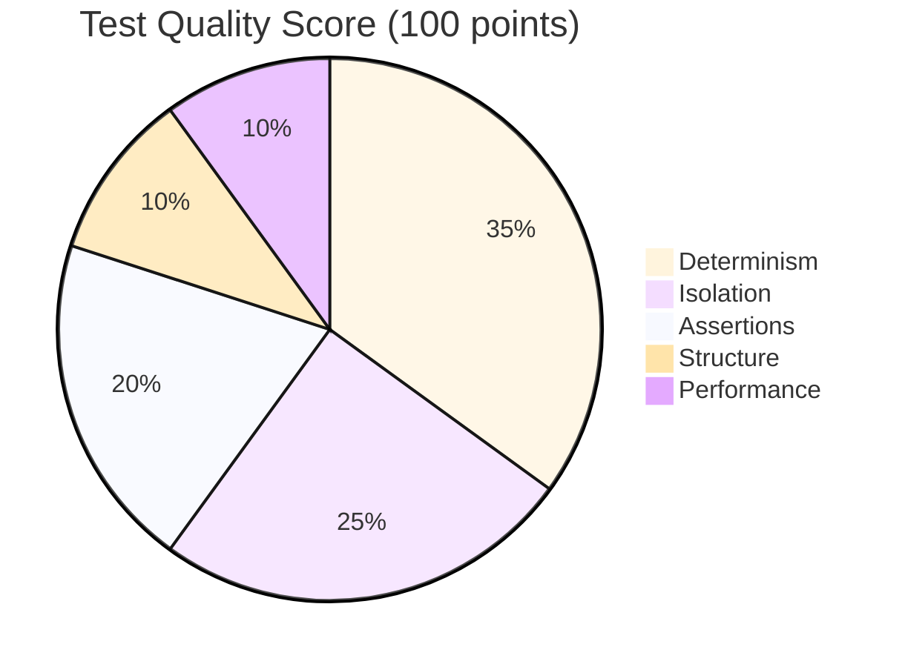
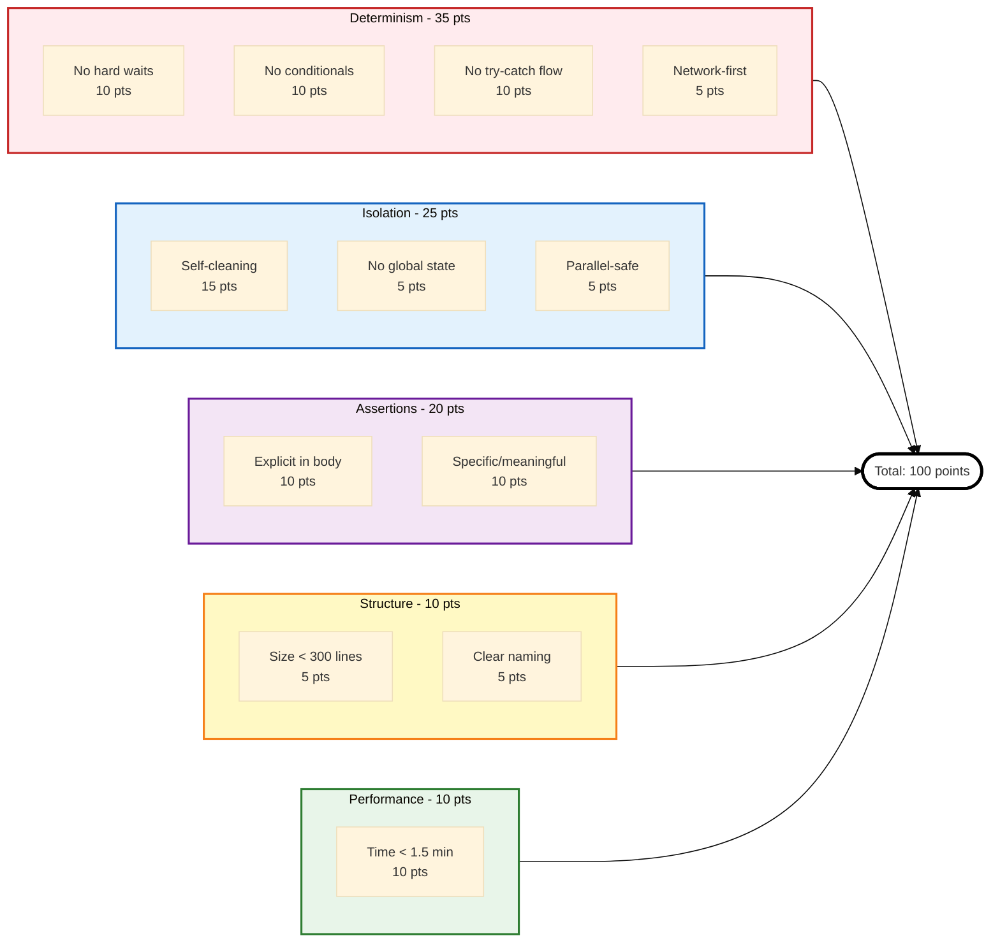

# Test Quality Standards Explained

Test quality standards define what makes a test "good" in TEA. These aren't suggestions - they're the Definition of Done that prevents tests from rotting in review.

## Overview

**TEA's Quality Principles:**
- **Deterministic** - Same result every run
- **Isolated** - No dependencies on other tests
- **Explicit** - Assertions visible in test body
- **Focused** - Single responsibility, appropriate size
- **Fast** - Execute in reasonable time

**Why these matter:** Tests that violate these principles create maintenance burden, slow down development, and lose team trust.

## The Problem

### Tests That Rot in Review

```typescript
// ❌ The anti-pattern: This test will rot
test('user can do stuff', async ({ page }) => {
  await page.goto('/');
  await page.waitForTimeout(5000);  // Non-deterministic

  if (await page.locator('.banner').isVisible()) {  // Conditional
    await page.click('.dismiss');
  }

  try {  // Try-catch for flow control
    await page.click('#load-more');
  } catch (e) {
    // Silently continue
  }

  // ... 300 more lines of test logic
  // ... no clear assertions
});
```

**What's wrong:**
- **Hard wait** - Flaky, wastes time
- **Conditional** - Non-deterministic behavior
- **Try-catch** - Hides failures
- **Too large** - Hard to maintain
- **Vague name** - Unclear purpose
- **No explicit assertions** - What's being tested?

**Result:** PR review comments: "This test is flaky, please fix" → never merged → test deleted → coverage lost

### AI-Generated Tests Without Standards

AI-generated tests without quality guardrails:

```typescript
// AI generates 50 tests like this:
test('test1', async ({ page }) => {
  await page.goto('/');
  await page.waitForTimeout(3000);
  // ... flaky, vague, redundant
});

test('test2', async ({ page }) => {
  await page.goto('/');
  await page.waitForTimeout(3000);
  // ... duplicates test1
});

// ... 48 more similar tests
```

**Result:** 50 tests, 80% redundant, 90% flaky, 0% trusted by team - low-quality outputs that create maintenance burden.

## The Solution: TEA's Quality Standards

### 1. Determinism (No Flakiness)

**Rule:** Test produces same result every run.

**Requirements:**
- ❌ No hard waits (`waitForTimeout`)
- ❌ No conditionals for flow control (`if/else`)
- ❌ No try-catch for flow control
- ✅ Use network-first patterns (wait for responses)
- ✅ Use explicit waits (waitForSelector, waitForResponse)

**Bad Example:**
```typescript
test('flaky test', async ({ page }) => {
  await page.click('button');
  await page.waitForTimeout(2000);  // ❌ Might be too short

  if (await page.locator('.modal').isVisible()) {  // ❌ Non-deterministic
    await page.click('.dismiss');
  }

  try {  // ❌ Silently handles errors
    await expect(page.locator('.success')).toBeVisible();
  } catch (e) {
    // Test passes even if assertion fails!
  }
});
```

**Good Example (Vanilla Playwright):**
```typescript
test('deterministic test', async ({ page }) => {
  const responsePromise = page.waitForResponse(
    resp => resp.url().includes('/api/submit') && resp.ok()
  );

  await page.click('button');
  await responsePromise;  // ✅ Wait for actual response

  // Modal should ALWAYS show (make it deterministic)
  await expect(page.locator('.modal')).toBeVisible();
  await page.click('.dismiss');

  // Explicit assertion (fails if not visible)
  await expect(page.locator('.success')).toBeVisible();
});
```

**With Playwright Utils (Even Cleaner):**
```typescript
import { test } from '@seontechnologies/playwright-utils/fixtures';
import { expect } from '@playwright/test';

test('deterministic test', async ({ page, interceptNetworkCall }) => {
  const submitCall = interceptNetworkCall({
    method: 'POST',
    url: '**/api/submit'
  });

  await page.click('button');

  // Wait for actual response (automatic JSON parsing)
  const { status, responseJson } = await submitCall;
  expect(status).toBe(200);

  // Modal should ALWAYS show (make it deterministic)
  await expect(page.locator('.modal')).toBeVisible();
  await page.click('.dismiss');

  // Explicit assertion (fails if not visible)
  await expect(page.locator('.success')).toBeVisible();
});
```

**Why both work:**
- Waits for actual event (network response)
- No conditionals (behavior is deterministic)
- Assertions fail loudly (no silent failures)
- Same result every run (deterministic)

**Playwright Utils additional benefits:**
- Automatic JSON parsing
- `{ status, responseJson }` structure (can validate response data)
- No manual `await response.json()`

### 2. Isolation (No Dependencies)

**Rule:** Test runs independently, no shared state.

**Requirements:**
- ✅ Self-cleaning (cleanup after test)
- ✅ No global state dependencies
- ✅ Can run in parallel
- ✅ Can run in any order
- ✅ Use unique test data

**Bad Example:**
```typescript
// ❌ Tests depend on execution order
let userId: string;  // Shared global state

test('create user', async ({ apiRequest }) => {
  const { body } = await apiRequest({
    method: 'POST',
    path: '/api/users',
    body: { email: 'test@example.com' }   (hard-coded)
  });
  userId = body.id;  // Store in global
});

test('update user', async ({ apiRequest }) => {
  // Depends on previous test setting userId
  await apiRequest({
    method: 'PATCH',
    path: `/api/users/${userId}`,
    body: { name: 'Updated' }  
  });
  // No cleanup - leaves user in database
});
```

**Problems:**
- Tests must run in order (can't parallelize)
- Second test fails if first skipped (`.only`)
- Hard-coded data causes conflicts
- No cleanup (database fills with test data)

**Good Example (Vanilla Playwright):**
```typescript
test('should update user profile', async ({ request }) => {
  // Create unique test data
  const testEmail = `test-${Date.now()}@example.com`;

  // Setup: Create user
  const createResp = await request.post('/api/users', {
    data: { email: testEmail, name: 'Original' }
  });
  const user = await createResp.json();

  // Test: Update user
  const updateResp = await request.patch(`/api/users/${user.id}`, {
    data: { name: 'Updated' }
  });
  const updated = await updateResp.json();

  expect(updated.name).toBe('Updated');

  // Cleanup: Delete user
  await request.delete(`/api/users/${user.id}`);
});
```

**Even Better (With Playwright Utils):**
```typescript
import { test } from '@seontechnologies/playwright-utils/api-request/fixtures';
import { expect } from '@playwright/test';
import { faker } from '@faker-js/faker';

test('should update user profile', async ({ apiRequest }) => {
  // Dynamic unique test data
  const testEmail = faker.internet.email();

  // Setup: Create user
  const { status: createStatus, body: user } = await apiRequest({
    method: 'POST',
    path: '/api/users',
    body: { email: testEmail, name: faker.person.fullName() }  
  });

  expect(createStatus).toBe(201);

  // Test: Update user
  const { status, body: updated } = await apiRequest({
    method: 'PATCH',
    path: `/api/users/${user.id}`,
    body: { name: 'Updated Name' }  
  });

  expect(status).toBe(200);
  expect(updated.name).toBe('Updated Name');

  // Cleanup: Delete user
  await apiRequest({
    method: 'DELETE',
    path: `/api/users/${user.id}`
  });
});
```

**Playwright Utils Benefits:**
- `{ status, body }` destructuring (cleaner than `response.status()` + `await response.json()`)
- No manual `await response.json()`
- Automatic retry for 5xx errors
- Optional schema validation with `.validateSchema()`

**Why it works:**
- No global state
- Unique test data (no conflicts)
- Self-cleaning (deletes user)
- Can run in parallel
- Can run in any order

### 3. Explicit Assertions (No Hidden Validation)

**Rule:** Assertions visible in test body, not abstracted.

**Requirements:**
- ✅ Assertions in test code (not helper functions)
- ✅ Specific assertions (not generic `toBeTruthy`)
- ✅ Meaningful expectations (test actual behavior)

**Bad Example:**
```typescript
// ❌ Assertions hidden in helper
async function verifyProfilePage(page: Page) {
  // Assertions buried in helper (not visible in test)
  await expect(page.locator('h1')).toBeVisible();
  await expect(page.locator('.email')).toContainText('@');
  await expect(page.locator('.name')).not.toBeEmpty();
}

test('profile page', async ({ page }) => {
  await page.goto('/profile');
  await verifyProfilePage(page);  // What's being verified?
});
```

**Problems:**
- Can't see what's tested (need to read helper)
- Hard to debug failures (which assertion failed?)
- Reduces test readability
- Hides important validation

**Good Example:**
```typescript
// ✅ Assertions explicit in test
test('should display profile with correct data', async ({ page }) => {
  await page.goto('/profile');

  // Explicit assertions - clear what's tested
  await expect(page.locator('h1')).toContainText('Test User');
  await expect(page.locator('.email')).toContainText('test@example.com');
  await expect(page.locator('.bio')).toContainText('Software Engineer');
  await expect(page.locator('img[alt="Avatar"]')).toBeVisible();
});
```

**Why it works:**
- See what's tested at a glance
- Debug failures easily (know which assertion failed)
- Test is self-documenting
- No hidden behavior

**Exception:** Use helper for setup/cleanup, not assertions.

### 4. Focused Tests (Appropriate Size)

**Rule:** Test has single responsibility, reasonable size.

**Requirements:**
- ✅ Test size < 300 lines
- ✅ Single responsibility (test one thing well)
- ✅ Clear describe/test names
- ✅ Appropriate scope (not too granular, not too broad)

**Bad Example:**
```typescript
// ❌ 500-line test testing everything
test('complete user flow', async ({ page }) => {
  // Registration (50 lines)
  await page.goto('/register');
  await page.fill('#email', 'test@example.com');
  // ... 48 more lines

  // Profile setup (100 lines)
  await page.goto('/profile');
  // ... 98 more lines

  // Settings configuration (150 lines)
  await page.goto('/settings');
  // ... 148 more lines

  // Data export (200 lines)
  await page.goto('/export');
  // ... 198 more lines

  // Total: 500 lines, testing 4 different features
});
```

**Problems:**
- Failure in line 50 prevents testing lines 51-500
- Hard to understand (what's being tested?)
- Slow to execute (testing too much)
- Hard to debug (which feature failed?)

**Good Example:**
```typescript
// ✅ Focused tests - one responsibility each

test('should register new user', async ({ page }) => {
  await page.goto('/register');
  await page.fill('#email', 'test@example.com');
  await page.fill('#password', 'password123');
  await page.click('button[type="submit"]');

  await expect(page).toHaveURL('/welcome');
  await expect(page.locator('h1')).toContainText('Welcome');
});

test('should configure user profile', async ({ page, authSession }) => {
  await authSession.login({ email: 'test@example.com', password: 'pass' });
  await page.goto('/profile');

  await page.fill('#name', 'Test User');
  await page.fill('#bio', 'Software Engineer');
  await page.click('button:has-text("Save")');

  await expect(page.locator('.success')).toBeVisible();
});

// ... separate tests for settings, export (each < 50 lines)
```

**Why it works:**
- Each test has one responsibility
- Failure is easy to diagnose
- Can run tests independently
- Test names describe exactly what's tested

### 5. Fast Execution (Performance Budget)

**Rule:** Individual test executes in < 1.5 minutes.

**Requirements:**
- ✅ Test execution < 90 seconds
- ✅ Efficient selectors (getByRole > XPath)
- ✅ Minimal redundant actions
- ✅ Parallel execution enabled

**Bad Example:**
```typescript
// ❌ Slow test (3+ minutes)
test('slow test', async ({ page }) => {
  await page.goto('/');
  await page.waitForTimeout(10000);  // 10s wasted

  // Navigate through 10 pages (2 minutes)
  for (let i = 1; i <= 10; i++) {
    await page.click(`a[href="/page-${i}"]`);
    await page.waitForTimeout(5000);  // 5s per page = 50s wasted
  }

  // Complex XPath selector (slow)
  await page.locator('//div[@class="container"]/section[3]/div[2]/p').click();

  // More waiting
  await page.waitForTimeout(30000);  // 30s wasted

  await expect(page.locator('.result')).toBeVisible();
});
```

**Total time:** 3+ minutes (95 seconds wasted on hard waits)

**Good Example (Vanilla Playwright):**
```typescript
// ✅ Fast test (< 10 seconds)
test('fast test', async ({ page }) => {
  // Set up response wait
  const apiPromise = page.waitForResponse(
    resp => resp.url().includes('/api/result') && resp.ok()
  );

  await page.goto('/');

  // Direct navigation (skip intermediate pages)
  await page.goto('/page-10');

  // Efficient selector
  await page.getByRole('button', { name: 'Submit' }).click();

  // Wait for actual response (fast when API is fast)
  await apiPromise;

  await expect(page.locator('.result')).toBeVisible();
});
```

**With Playwright Utils:**
```typescript
import { test } from '@seontechnologies/playwright-utils/fixtures';
import { expect } from '@playwright/test';

test('fast test', async ({ page, interceptNetworkCall }) => {
  // Set up interception
  const resultCall = interceptNetworkCall({
    method: 'GET',
    url: '**/api/result'
  });

  await page.goto('/');

  // Direct navigation (skip intermediate pages)
  await page.goto('/page-10');

  // Efficient selector
  await page.getByRole('button', { name: 'Submit' }).click();

  // Wait for actual response (automatic JSON parsing)
  const { status, responseJson } = await resultCall;

  expect(status).toBe(200);
  await expect(page.locator('.result')).toBeVisible();

  // Can also validate response data if needed
  // expect(responseJson.data).toBeDefined();
});
```

**Total time:** < 10 seconds (no wasted waits)

**Both examples achieve:**
- No hard waits (wait for actual events)
- Direct navigation (skip unnecessary steps)
- Efficient selectors (getByRole)
- Fast execution

**Playwright Utils bonus:**
- Can validate API response data easily
- Automatic JSON parsing
- Cleaner API

## TEA's Quality Scoring

TEA reviews tests against these standards in `test-review`:

### Scoring Categories (100 points total)

**Determinism (35 points):**
- No hard waits: 10 points
- No conditionals: 10 points
- No try-catch flow: 10 points
- Network-first patterns: 5 points

**Isolation (25 points):**
- Self-cleaning: 15 points
- No global state: 5 points
- Parallel-safe: 5 points

**Assertions (20 points):**
- Explicit in test body: 10 points
- Specific and meaningful: 10 points

**Structure (10 points):**
- Test size < 300 lines: 5 points
- Clear naming: 5 points

**Performance (10 points):**
- Execution time < 1.5 min: 10 points

#### Quality Scoring Breakdown





### Score Interpretation

| Score      | Interpretation | Action                                 |
| ---------- | -------------- | -------------------------------------- |
| **90-100** | Excellent      | Production-ready, minimal changes      |
| **80-89**  | Good           | Minor improvements recommended         |
| **70-79**  | Acceptable     | Address recommendations before release |
| **60-69**  | Needs Work     | Fix critical issues                    |
| **< 60**   | Critical       | Significant refactoring needed         |

## Comparison: Good vs Bad Tests

### Example: User Login

**Bad Test (Score: 45/100):**
```typescript
test('login test', async ({ page }) => {  // Vague name
  await page.goto('/login');
  await page.waitForTimeout(3000);  // -10 (hard wait)

  await page.fill('[name="email"]', 'test@example.com');
  await page.fill('[name="password"]', 'password');

  if (await page.locator('.remember-me').isVisible()) {  // -10 (conditional)
    await page.click('.remember-me');
  }

  await page.click('button');

  try {  // -10 (try-catch flow)
    await page.waitForURL('/dashboard', { timeout: 5000 });
  } catch (e) {
    // Ignore navigation failure
  }

  // No assertions! -10
  // No cleanup! -10
});
```

**Issues:**
- Determinism: 5/35 (hard wait, conditional, try-catch)
- Isolation: 10/25 (no cleanup)
- Assertions: 0/20 (no assertions!)
- Structure: 15/10 (okay)
- Performance: 5/10 (slow)
- **Total: 45/100**

**Good Test (Score: 95/100):**
```typescript
test('should login with valid credentials and redirect to dashboard', async ({ page, authSession }) => {
  // Use fixture for deterministic auth
  const loginPromise = page.waitForResponse(
    resp => resp.url().includes('/api/auth/login') && resp.ok()
  );

  await page.goto('/login');
  await page.getByLabel('Email').fill('test@example.com');
  await page.getByLabel('Password').fill('password123');
  await page.getByRole('button', { name: 'Sign in' }).click();

  // Wait for actual API response
  const response = await loginPromise;
  const { token } = await response.json();

  // Explicit assertions
  expect(token).toBeDefined();
  await expect(page).toHaveURL('/dashboard');
  await expect(page.getByText('Welcome back')).toBeVisible();

  // Cleanup handled by authSession fixture
});
```

**Quality:**
- Determinism: 35/35 (network-first, no conditionals)
- Isolation: 25/25 (fixture handles cleanup)
- Assertions: 20/20 (explicit and specific)
- Structure: 10/10 (clear name, focused)
- Performance: 5/10 (< 1 min)
- **Total: 95/100**

### Example: API Testing

**Bad Test (Score: 50/100):**
```typescript
test('api test', async ({ request }) => {
  const response = await request.post('/api/users', {
    data: { email: 'test@example.com' }  // Hard-coded (conflicts)
  });

  if (response.ok()) {  // Conditional
    const user = await response.json();
    // Weak assertion
    expect(user).toBeTruthy();
  }

  // No cleanup - user left in database
});
```

**Good Test (Score: 92/100):**
```typescript
test('should create user with valid data', async ({ apiRequest }) => {
  // Unique test data
  const testEmail = `test-${Date.now()}@example.com`;

  // Create user
  const { status, body } = await apiRequest({
    method: 'POST',
    path: '/api/users',
    body: { email: testEmail, name: 'Test User' }
  });

  // Explicit assertions
  expect(status).toBe(201);
  expect(body.id).toBeDefined();
  expect(body.email).toBe(testEmail);
  expect(body.name).toBe('Test User');

  // Cleanup
  await apiRequest({
    method: 'DELETE',
    path: `/api/users/${body.id}`
  });
});
```

## How TEA Enforces Standards

### During Test Generation (`atdd`, `automate`)

TEA generates tests following standards by default:

```typescript
// TEA-generated test (automatically follows standards)
test('should submit contact form', async ({ page }) => {
  // Network-first pattern (no hard waits)
  const submitPromise = page.waitForResponse(
    resp => resp.url().includes('/api/contact') && resp.ok()
  );

  // Accessible selectors (resilient)
  await page.getByLabel('Name').fill('Test User');
  await page.getByLabel('Email').fill('test@example.com');
  await page.getByLabel('Message').fill('Test message');
  await page.getByRole('button', { name: 'Send' }).click();

  const response = await submitPromise;
  const result = await response.json();

  // Explicit assertions
  expect(result.success).toBe(true);
  await expect(page.getByText('Message sent')).toBeVisible();

  // Size: 15 lines (< 300 ✓)
  // Execution: ~2 seconds (< 90s ✓)
});
```

### During Test Review (`test-review`)

TEA audits tests and flags violations:

```markdown
## Critical Issues

### Hard Wait Detected (tests/login.spec.ts:23)
**Issue:** `await page.waitForTimeout(3000)`
**Score Impact:** -10 (Determinism)
**Fix:** Use network-first pattern

### Conditional Flow Control (tests/profile.spec.ts:45)
**Issue:** `if (await page.locator('.banner').isVisible())`
**Score Impact:** -10 (Determinism)
**Fix:** Make banner presence deterministic

## Recommendations

### Extract Fixture (tests/auth.spec.ts)
**Issue:** Login code repeated 5 times
**Score Impact:** -3 (Structure)
**Fix:** Extract to authSession fixture
```

## Definition of Done Checklist

When is a test "done"?

**Test Quality DoD:**
- [ ] No hard waits (`waitForTimeout`)
- [ ] No conditionals for flow control
- [ ] No try-catch for flow control
- [ ] Network-first patterns used
- [ ] Assertions explicit in test body
- [ ] Test size < 300 lines
- [ ] Clear, descriptive test name
- [ ] Self-cleaning (cleanup in afterEach or test)
- [ ] Unique test data (no hard-coded values)
- [ ] Execution time < 1.5 minutes
- [ ] Can run in parallel
- [ ] Can run in any order

**Code Review DoD:**
- [ ] Test quality score > 80
- [ ] No critical issues from `test-review`
- [ ] Follows project patterns (fixtures, selectors)
- [ ] Test reviewed by team member

## Common Quality Issues

### Issue: "My test needs conditionals for optional elements"

**Wrong approach:**
```typescript
if (await page.locator('.banner').isVisible()) {
  await page.click('.dismiss');
}
```

**Right approach - Make it deterministic:**
```typescript
// Option 1: Always expect banner
await expect(page.locator('.banner')).toBeVisible();
await page.click('.dismiss');

// Option 2: Test both scenarios separately
test('should show banner for new users', ...);
test('should not show banner for returning users', ...);
```

### Issue: "My test needs try-catch for error handling"

**Wrong approach:**
```typescript
try {
  await page.click('#optional-button');
} catch (e) {
  // Silently continue
}
```

**Right approach - Make failures explicit:**
```typescript
// Option 1: Button should exist
await page.click('#optional-button');  // Fails loudly if missing

// Option 2: Button might not exist (test both)
test('should work with optional button', async ({ page }) => {
  const hasButton = await page.locator('#optional-button').count() > 0;
  if (hasButton) {
    await page.click('#optional-button');
  }
  // But now you're testing optional behavior explicitly
});
```

### Issue: "Hard waits are easier than network patterns"

**Short-term:** Hard waits seem simpler
**Long-term:** Flaky tests waste more time than learning network patterns

**Investment:**
- 30 minutes to learn network-first patterns
- Prevents hundreds of hours debugging flaky tests
- Tests run faster (no wasted waits)
- Team trusts test suite

## Technical Implementation

For detailed test quality patterns, see:
- [Test Quality Fragment](/docs/tea/reference/knowledge-base.md#quality-standards)
- [Test Levels Framework Fragment](/docs/tea/reference/knowledge-base.md#quality-standards)
- [Complete Knowledge Base Index](/docs/tea/reference/knowledge-base.md)

## Related Concepts

**Core TEA Concepts:**
- [Risk-Based Testing](/docs/tea/explanation/risk-based-testing.md) - Quality scales with risk
- [Knowledge Base System](/docs/tea/explanation/knowledge-base-system.md) - How standards are enforced
- [Engagement Models](/docs/tea/explanation/engagement-models.md) - Quality in different models

**Technical Patterns:**
- [Network-First Patterns](/docs/tea/explanation/network-first-patterns.md) - Determinism explained
- [Fixture Architecture](/docs/tea/explanation/fixture-architecture.md) - Isolation through fixtures

**Overview:**
- [TEA Overview](/docs/tea/explanation/tea-overview.md) - Quality standards in lifecycle
- [Testing as Engineering](/docs/tea/explanation/testing-as-engineering.md) - Why quality matters

## Practical Guides

**Workflow Guides:**
- [How to Run Test Review](/docs/tea/how-to/workflows/run-test-review.md) - Audit against these standards
- [How to Run ATDD](/docs/tea/how-to/workflows/run-atdd.md) - Generate quality tests
- [How to Run Automate](/docs/tea/how-to/workflows/run-automate.md) - Expand with quality

**Use-Case Guides:**
- [Using TEA with Existing Tests](/docs/tea/how-to/brownfield/use-tea-with-existing-tests.md) - Improve legacy quality
- [Running TEA for Enterprise](/docs/tea/how-to/brownfield/use-tea-for-enterprise.md) - Enterprise quality thresholds

## Reference

- [TEA Command Reference](/docs/tea/reference/commands.md) - `test-review` command
- [Knowledge Base Index](/docs/tea/reference/knowledge-base.md) - Test quality fragment
- [Glossary](/docs/tea/glossary/index.md#test-architect-tea-concepts) - TEA terminology

---

Generated with [BMad Method](https://bmad-method.org) - TEA (Test Architect)
